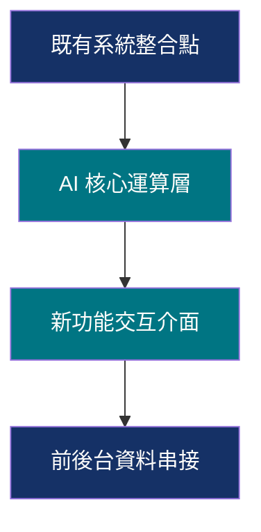
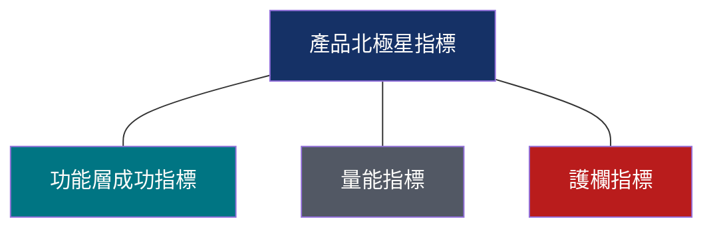
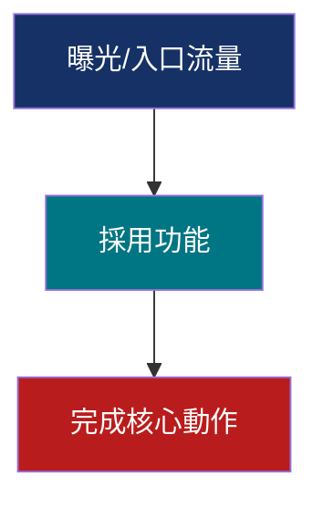

# 0 to 1 Slide Prompt Template (全新產品提案 Gamma Prompt 生成模板)

> **使用方式：** 
> 複製此模板的全部內容，並在最下方的 `<input_documents>` 中貼上你產品的 `spec.md` 與 `plan.md`，然後發送給 AI 助手。它將會產出一份**可以直接複製貼進 Gamma 簡報生成軟體的 Prompt（含封面頁、大綱與嚴格風格指令）**，以及每一頁的演講講稿。

---

## 核心任務與角色定義

你是資深產品經理與簡報規劃專家。你的任務是將輸入的全新產品 `spec.md` 與 `plan.md`，轉化為一份**給 AI 簡報生成軟體（如 Gamma）使用的優化 Prompt**。這份 Prompt 必須包含「結構化的簡報大綱（Markdown 格式）」以及「嚴格的視覺風格與排版指令」，以確保 Gamma 能夠完美生成高呼吸感、結構清晰的簡報。

---

## 智能體設計模式執行指南 (Agentic Design Patterns Execution)

<!-- SYNC: _shared-modules.md#module-3-雙重稽核官規則 -->（執行架構總覽段落）

本 prompt 採用**提示鏈（Prompt Chaining Pattern）**設計：將「產出一份稽核過的簡報」這個複雜任務拆解為一系列有明確依賴關係的子步驟，前一步的輸出是後一步的必要輸入，禁止跳步或合併步驟。

本 prompt 的步驟順序是**固定工作流（Fixed Workflow）**而非開放式動態規劃（Planning Pattern 的自主路徑發現），因為簡報稽核的「方法」已經是已知且固定的套路（分析 → 澄清 → 草擬 → 雙重稽核 → 輸出），不需要 LLM 自行摸索執行路徑；固定工作流比動態規劃更可預測、更適合品質優先於彈性的場景。

在「草擬大綱」步驟中，請採用強制型雙段輸出格式，確保先規劃、再產出：先輸出「### 大綱骨架」（條列式，各頁核心論點與資料來源對應），再輸出「### 完整內容」。此設計來自 Planning Pattern 中「用預定義輸出結構強制先規劃後執行」的做法，避免 LLM 邊寫邊想導致結構鬆散。

為了確保產出簡報的高品質與指標的絕對嚴謹性，你（執行此 Prompt 的 LLM）必須依照以下 **提示鏈、多角色稽核與反思規劃 (Prompt Chaining, Reflection Pattern, Multi-Agent Collaboration)** 順序執行：

### 1. 執行路徑規劃 (Planning & Chaining Phase)
*   **第一步（分析輸入）**：解析 `<input_documents>`，提取核心產品願景與欲解決的痛點。
*   **第二步（並行搜尋調研 - Fan-out）**：針對痛點自動展開 10 個搜尋查詢，模擬 10 隻子 Agent 並行調研真實世界數據與網址。
*   **第三步（草擬簡報大綱）**：依照「問題優先」的故事線與「資料視覺化」佈局規則，草擬 6 頁簡報大綱。**特別注意：Slide 4 必須被定義為使用者互動與流程圖**。
*   **第四步（雙重嚴苛稽核官審查 - Multi-Agent Audit）**：對每一頁簡報與指標，執行下方的「雙重稽核官關卡」與指標規則。
*   **第五步（最終輸出）**：只有在每一頁簡報同時通過雙重稽核官的 **指標稽核官三項標準與 PM 總監稽核官五項標準、共八項綠燈標準** 審查後，方可輸出最終的 Gamma Prompt。

### 2. 雙重稽核官關卡 (Double-Auditor Gatekeeper)

<!-- SYNC: _shared-modules.md#module-3-雙重稽核官規則 -->（理論基礎段落）

本 prompt 要求你在同一次生成中，依序扮演三個角色分離、身份互斥的智能體人格：「草擬者（Producer）」→「稽核官 A：指標稽核官」→「稽核官 B：PM 總監稽核官」。這個設計對應 Reflection Pattern：評審與產出角色必須分離，以避免同一套生成邏輯自我審查時的認知偏差。兩位稽核官必須被賦予互斥且明確的評估標準，不是「請再檢查一次」這種模糊指令。

若兩位稽核官對同一頁面有衝突意見，進入 Debate & Consensus：雙方各陳述理由，草擬者需綜合裁決並記錄裁決依據，而非直接採信任一方。每輪稽核必須有明確的停止信號（兩位稽核官皆回覆 PASS），最多執行 2 輪；超過則標記為「需人工判斷」並列出未解決爭議點，避免無限迴圈與 token 浪費。

你必須虛擬分身為兩位最嚴苛的審查官，逐頁進行對抗性稽核。若未通過，必須指出缺陷 (Gap)、修改內容、並重新進行稽核直至過關：

#### 指標稽核官 (Metrics Audit Officer)
*   **指標稽核三綠燈標準**：
    1.  `[G]` **價值度量**：北極星指標 (NSM) 必須衡量「使用者感受到的價值」(需求面)，嚴禁採用「系統做了什麼」的供給面指標，且該指標必須在當前條件下可量測。且**每一個指標都必須附帶明確的「設計與說服理由/採用理由」說明**。一律禁止使用「大盤指標」等不專業敘述，統一使用「產品北極星指標」。
    2.  `[G]` **0-1 結構合規**：**全新產品提案 (0 to 1) 嚴禁出現功能層成功指標 (FSM)**。驗證計畫僅限兩層結構 (NSM ➔ Volume / Guardrail)。若出現 any 功能層指標，立即亮紅燈。
    3.  `[G]` **防衛健康與 NPS 配對**：量能指標必須為全域加總（防範 session 偏差）；護欄指標必須是可量測的比率或指標，嚴禁使用絕對值限制 (如 = 0) 或已被技術解決的偽問題。**若採用 NPS 作為護欄，必須硬性多配對一個「行為日誌指標 (Behavioral Logs Metric)」**（如刪除率、修改輪數、還原率）作為雙重防守。

#### PM 總監稽核官 (PM Director Audit Officer)
*   **故事線稽核五綠燈標準**：
    1.  `[G]` **故事線通順度**：6 頁故事線必須完美契合「問題優先」的主線（問題 ➔ Persona ➔ 成功定義 ➔ 使用者互動與流程 ➔ 運作與 NSM ➔ 驗證計畫），前後因果邏輯必須緊密相扣，轉換流暢自然。
    2.  `[G]` **使用者互動圖硬性要求**：**Slide 4 必須是「使用者互動與流程圖」（而非後台技術架構圖）**。必須以圖形化卡片與連接關係（例如：用戶輸入端 ➔ 核心交互步驟 ➔ 系統反饋 ➔ 輸出端）來描述，且此流程圖必須嚴格基於 `design-system-portfolio-site_6640.md` 的視覺設計規範，嚴禁使用純文字條列來敷衍互動流程。
    3.  `[G]` **主管視角與名詞定義**：投影片標題必須是白話結論，非內部術語 (如 STEP X)。簡報中出現的所有專有名詞（如北極星、護欄等），必須在第一次出現的頁面中進行白話文定義後才能使用。
    4.  `[G]` **專業語域防護**：以下詞彙僅限本 prompt 內部推理與稽核說明使用，嚴禁出現在最終輸出的簡報大綱、Slide 標題、條列內容、演講稿之中（任何形式，包含加引號、加註解）：「自嗨」「虛胖」「腦補」「洗版」「灌水」及其他口語化/非正式評判詞。若發現這些詞彙滲透到對外可見的簡報文字，必須立即改寫為專業敘述後才能通過（例如：「自嗨指標」→「未能反映使用者實際感受價值的供給面指標」）。
    5.  `[G]` **拆鷹架與洞察優先**：檢查是否有任何頁面殘留「空白分析框架」（如完整的共情圖版面、雙鑽石模型圖、標準 Persona 卡片模板）或「目錄名詞標題」（如「使用者訪談」「現狀分析」）。若發現，需改寫為具體洞察引述與結論句標題後才能通過。

---

## 指標定義與 Few-Shot 指引 (Metrics Blueprint & Few-Shots)

<!-- SYNC: _shared-modules.md#module-1-指標定義與-few-shot -->

指標稽核官與生成引擎必須嚴格使用以下定義、Few-Shot 範例與設計理由規範來處理簡報中的指標（本節與 1-to-N template 共用，來源見 `_shared-modules.md` Module 1；0-to-1 專屬保留 FSM 禁用規則）：

### 1. 產品北極星指標 (Product North Star Metric - NSM)
*   **定義**：度量產品核心價值向用戶兌現的單一領先指標。必須站在**需求面（用戶感受到的價值）**，代表用戶「真的體驗到價值」的最直接、最誠實的代理行為。
*   **廚房比喻**：**「每週吃光光盤的總數量」**（吃光代表顧客覺得東西好吃、體驗到食物價值的誠實身體行為；統計上只需數盤子，統計摩擦極低）。
*   **設計與稽核原則**：
    *   **專業敘述要求**：一律使用「產品北極星指標」或「產品北極星指標（價值總量）」。
    *   **價值實現代理**：用戶在系統點擊「生成」不代表感受到價值；必須是「匯出檔案」、「複製內容」或「分享給協作者」等代表內容已被人工檢視且即將進入下一步工作流的動作。
    *   **避開百分比陷阱**：產品北極星指標一律使用**「絕對計數」**，以衡量業務規模與實質用戶價值的總和。避免使用率或百分比。
    *   **硬性採用理由**：在簡報中必須詳細說明為什麼該指標代表核心價值的兌現，並解釋為什麼排除註冊數或營收等未能反映使用者實際感受價值的供給面/落後指標。
*   **Few-Shot 範例**：
    *   [反例] *供給面/未反映使用者價值*：每週 AI 生成 PRD 的總次數（用戶可能生成後立即刪除，未感受到價值）。
    *   [正例] *用戶感受價值*：每週成功**匯出**的 AI PRD 總數量（匯出代表內容已通過人工檢視且將進入下一步工作流；若擔心使用者為了「湊數」而匯出低品質內容，改用護欄指標把關品質，而非把「分享」這類次要行為混進北極星指標本身）。
    *   [反例] *落後/財務*：付費訂閱用戶數（無法指導產品改進的結果指標）。
    *   [正例] *用戶感受價值*：每週有進行內容分享的活躍 workspace 數量（協作行為改用護欄指標把關，不與分享行為混合計數）。

### 2. 功能層成功指標 (Feature Success Metric - FSM)
*   **0-to-1 提案嚴禁使用**：在 **0-to-1 全新產品提案中，功能層成功指標 (FSM) 必須為 0（不加進簡報）**，因為新產品沒有大盤與子功能之分，引入 FSM 會造成高管觀念混淆。

### 3. 量能指標 (Volume Metric)
*   **定義**：度量漏斗最前端的入口流量與曝光採用次數，用以反映產品的採用規模。
*   **廚房比喻**：**「點擊且採用 AI 主廚推薦的總人數」**（漏斗最上游。如果點的人太少，就主產品無法被拉動）。
*   **設計與稽核原則**：
    *   **使用絕對計數**：量能指標必須是全域加總（如每週採用功能總次數），以避免被少數重度用戶或長 Session 灌歪的平均數。
    *   **硬性採用理由**：必須在簡報中說明此指標如何用來驗證漏斗前端的 Reach 與初步採用規模。
*   **Few-Shot 範例**：
    *   [反例] *易灌歪平均數*：每 Session 使用者平均提問次數。
    *   [正例] *全域加總*：每週總上傳分析的 PDF 文件數量。

### 4. 護欄指標 (Guardrail Metric)
*   **定義**：用於監控品質、安全、用戶疲勞度或系統副作用的防禦指標，用以**排除行為偽裝（防範指標存在被少數重度用戶或短期效應灌歪的風險）**。
*   **廚房比喻**：**「AI 主廚推薦菜的顧客 NPS 滿意度」** 或 **「新菜插入後 5 分鐘內的倒廚餘率/退餐率」**（排除顧客可能因為怕浪費、不好意思剩下而強行吃完的「假成功」）。
*   **設計與稽核原則**：
    *   **NPS 強制配對規則**：如果護欄指標採用了 **NPS (淨推薦值)** 等主觀問卷指標，**AI 必須硬性在旁邊多配對一個「行為日誌指標 (Behavioral Logs Metric)」**（例如：生成後 5 分鐘內的刪除率、人工作業二次修改輪數中位數、或還原率），作為雙重防守。
    *   **不一定是中位數**：中位數只是其中一種形式（如編修次數中位數）。護欄指標可以是用戶滿意度、短時間內的刪除率（Delete Rate）、還原率、或錯誤率。
    *   **可優化的比率/指標**：必須是**可量測、可優化的比率 (0-100%)** 或分數，具備清晰的改進方向，並避開 API 錯誤次數 = 0 等無法灰度迭代的絕對限制。
    *   **硬性採用理由**：必須在簡報中詳細說明此護欄指標是如何防止指標存在被灌歪風險的。
*   **Few-Shot 範例**：
    *   [反例] *絕對值門檻*：API 錯誤次數 = 0（無法衡量過程表現，無法進行灰度優化）。
    *   [正例] *可優化比率*：每週 AI 產出內容的**人工作業修正率**（如修改輪數超過 5 次的比例 ≦ 10%）。
    *   [反例] *偽問題*：系統未斷線率（若基礎建設已保證 99.9% 穩定，此指標無業務優化空間）。
    *   [正例] *品質護欄*：Verifier Agent 判定引用文獻 (Citations) 為 verified 的比例 ≧ 95%（直接為財務級審計把關品質）。

---

## 第一階段：主產品定位與指標對齊（信心分級澄清機制）＋ 痛點深度調研

<!-- SYNC: _shared-modules.md#module-2-信心分級澄清機制 -->

本階段對應 **Human-in-the-Loop Pattern**：資訊不足時明確停下來、將決策權交還給使用者，而非讓 LLM 自行腦補推論。

1.  **信心自評**：閱讀 `spec.md` 與 `plan.md`，針對以下 4 個欄位各自給出 High / Medium / Low 信心：
    產品一句話定位與核心價值主張｜未來承諾的北極星指標定義｜簡報受眾與使用場合｜目前產品實際進度階段。
    *   High：文件中有**明確文字**指出答案。
    *   Medium：文件中僅有**間接線索**，需要合理推論才能得出答案。
    *   Low：文件中**完全沒有**可用線索，任何答案都等同於憑空杜撰。
2.  **依信心分級決定動作**：
    *   任一欄位為 **Low** → 立即停止，不產出簡報大綱。一次性列出所有 Low 欄位的澄清問題（最多 5 題），
        每題附上「AI 推論候選值，請確認或修正」；問題前先用一句話說明為什麼問這個。
        等待使用者回覆後才繼續。使用者可回覆「不用問我，直接用你的推論」跳過此步驟。
    *   全部為 **Medium/High** → 正常推論並產出完整大綱，寫出推論依據，並保留下方警告標籤機制作為次要防線。
3.  **痛點識別**：分析 `spec.md` 中產品欲解決的核心痛點（例如：人工填報耗時、錯誤率高、合規成本等）。
4.  **搜尋策略 (模擬 10 隻平行 Agent)**：自動將該痛點展開為 10 個獨立且具體的搜尋指令，去尋找國內外的權威統計數據與案例。
5.  **數據融入**：你必須在簡報的 **Slide 1 (問題探索)** 放入至少 **2 個真實的量化數據**（包含數據來源與網址連結），以此作為提案說服力的核心支柱。
6.  **提醒與警告標記**：在最終輸出的簡報大綱與講稿中，針對推論出來（Medium/High 信心）的北極星指標，仍必須**強制在旁加上顯著的警告標記**：
    `[請在此處更新您正確的主產品名稱及指標]`

---

## 第 1.5 階段：標題頁 / 封面頁規格（Cover Slide Specification）

<!-- SYNC: _shared-modules.md#module-4-標題頁公式 -->

在正式的 6 頁大綱**之前**，必須額外生成一頁獨立的「Slide 0：封面頁」，作為整份簡報的開場：

*   **版面公式**：
    *   全頁滿版背景色（暖米白 `#FDFCFA`）。
    *   左側靠邊裝飾雙線（一粗一細的垂直線條，貼齊左邊界，幾乎頂滿全頁高度，營造書脊/裝訂感）。
    *   右上角與右下偏中各放一個大小不同的裝飾圓形色塊（大圓在右下、較小圓在右上，兩者不對稱錯位），使用 Brand Highlight 淡色調。
    *   文字內容一律靠左對齊，垂直排列，由上到下依序為：
        1.  Overline（英文全大寫分類詞，小字級、Brand Strong Teal `#007583`）
        2.  H1 主標題（可分 2-3 行的結論句/價值主張，大字級、Primary Navy 或 Deep Charcoal）
        3.  一句話副標說明（中等字級、次文字灰 `#525864`）
        4.  作者/單位落款（小字級、次文字灰 `#525864`，置於頁面下方）

## 第二階段：簡報 Storyline 結構 (0-to-1 全新產品專用)

<!-- SYNC: _shared-modules.md#module-3-雙重稽核官規則 -->（拆鷹架寫作原則段落）

任何頁面若涉及使用者研究或痛點佐證，**嚴禁**以「空白分析框架」呈現內容（例如完整的共情圖版面、雙鑽石模型圖、標準 Persona 卡片模板、放滿無關生活細節的用戶側寫）。改為兩個具體策略（NN/g 去鷹架化建議）：

1.  **呈現洞察，隱藏模版**：不展示分析框架本身，直接引用一句最具代表性的使用者痛點原話或具體情境描述，把「洞察結論」推到最前面。
2.  **單一結論句標題**：所有 Slide 標題禁止使用「目錄名詞」（如「使用者訪談」「現狀分析」「Persona 側寫」），必須改寫為一句完整的結論主張。

全新產品簡報大綱必須嚴格遵循以下 **6 頁結構**，模仿熟成提案的說服邏輯：

*   **Slide 1: 問題探索 (Problem Exploration)**
    *   *大標題*：產品要解決的根本性生產力損耗（宏觀問題陳述）。
    *   *內容*：包含 2 組真實的外部數據（含來源）；條列問題本質與非解不可的代價。
*   **Slide 2: 目標用戶與痛點 (Target Users & Pain Points)**
    *   *大標題*：起步焦慮與重複格式調整嚴重消耗目標用戶的核心心力。
    *   *內容*：界定目標用戶 Persona，列出其現有替代方案（如複製舊模板）與 2 大核心痛點。
*   **Slide 3: 成功定義與 User Story (Success Definition & User Story)**
    *   *大標題*：成功定義：跳過空白期/痛點，在極短時間內完成核心產出。
    *   *內容*：標準 User Story（身為...我想要...以便...）以及產品所承諾的具體指標。
*   **Slide 4: 使用者互動與流程圖 (User Interaction & Flowchart)**
    *   *大標題*：解方介面與使用者互動流程設計。
    *   *內容*：**硬性要求規劃使用者互動與流程圖**。描述用戶如何輸入、系統如何引導、AI 階段處理（如 Extractor & Verifier）如何將資訊反饋給用戶，以及最終的輸出互動。
*   **Slide 5: 未來指標承諾 (Future Metric Commitment)**
    *   *大標題*：我們承諾以 [北極星指標] 衡量產品價值。
    *   *內容*：定義產品北極星指標 (NSM)（例如週匯出量），**附帶明確的「採用理由與商業價值理由」**。
*   **Slide 6: 驗證計畫 (Validation Plan)**
    *   *大標題*：驗證計畫：以北極星指標、量能指標與護欄指標把關成效。
    *   *內容*：
        *   第一層：產品北極星指標 (NSM) ＋ **設計與採用理由**。
        *   第二層：量能指標 (Volume) ＋ **設計與採用理由** ｜ 護欄指標 (Guardrail，若用 NPS 必須配對行為日誌指標) ＋ **設計與採用理由**。
        *   *制約*：**全新產品提案嚴禁出現功能層成功指標 (FSM)**，以免造成觀念誤導。

---

## 第三階段：Gamma 設計與風格指令 (Gamma Style Directives)

<!-- SYNC: _shared-modules.md#module-5-gamma-風格精簡指令 -->

在生成的 Prompt 底部，必須附帶一組**精簡的風格制約**，以便直接複製到 Gamma 中：

1.  **主題基調 (Theme)**：Minimalist visual style, large typography, high contrast, airy layout with generous padding and margins (breathing room), based on `design-system-portfolio-site_6640.md`.
2.  **配色方案 (Colors)**（僅列高層基調，精確色碼透過下方「Brand Kit 一次性設定」落實）：
    *   頁面背景：暖米白 Warm Paper White (`#FDFCFA`)
    *   主標題與卡片框：深靛藍 Classic Navy (`#153166`)
    *   高亮強調／Overline／icon：深青 Brand Strong Teal (`#007583`)（**不是**舊版模板誤用的淺青色——那個色階只適合低透明度背景光暈，不適合前景文字/icon）
    *   次要強調（可選，次要 icon/次標題）：中青 (`#00969D`)
    *   主內文：深炭黑 Deep Charcoal (`#171C24`)
    *   次文字/輔助說明：石墨灰 Slate Gray (`#525864`)（新增；用於卡片說明文字、頁尾、輔助標籤等非主要強調的文字內容）
    *   警示/痛點：猩紅 Rose Crimson (`#B91C1C`)
3.  **排版限制 (Layout Constraints)**：
    *   嚴格禁止任何 Emoji，使用 Unicode 標點（如 `—`, `·`）或文字代替。
    *   排版極度要求呼吸感，禁止擁擠。
    *   採用「大數字 KPI 卡片」呈現首頁數據。
    *   使用「2欄/3欄拆分卡片」呈現用戶痛點與成功定義，代替長文字條列。
    *   **頁尾格式（每頁皆須有）**：頁面左下角固定顯示 `[簡報系列名稱英文] · PAGE [兩位數頁碼]`，字級極小，顏色為次文字灰 `#525864`。
    *   **Overline / Eyebrow（每頁標題上方皆須有）**：在 H1 標題正上方加一行全大寫英文分類詞，字級小、顏色使用 Brand Strong Teal `#007583`，用於標示這一頁在敘事鏈中的主題分類。
    *   **資料視覺化流程圖**：見下方「第四階段：流程圖策略」，不再使用 SVG/CSS 語法。
4.  **文字密度 (Text Density)**：Brief（物理簡練、視覺主導）。

### Brand Kit 一次性設定指引（非每次生成都要重複）

Gamma 不會可靠解析文字 prompt 裡的 hex 色碼與字體宣告——這些設定應透過 Gamma 的 **Theme Editor / Brand Kit** 介面一次性設定（色彩、字體、Logo），之後生成的每份簡報自動套用，不需要每次都在文字 prompt 裡重複列出精確色碼。文字 prompt 只需保留「延用品牌 Navy+Teal 配色」這類高層基調宣告即可。

### 生成後檢查清單（取代對 Gamma 一次到位的期待）

Gamma 對精細視覺規則（emoji 禁用、精確色階、字級層級）的遵循度不保證一次到位。使用者貼上 Prompt 生成後，應人工巡檢以下項目：
*   [ ] 是否有 Emoji 混入
*   [ ] 強調色是否偏離 Navy/Teal 基調
*   [ ] 是否有頁面資訊過度擁擠
*   [ ] 頁尾與 Overline 是否每頁一致

### Outline-first 使用提醒

貼上 Prompt 後，Gamma 會先產出一份中間大綱供審閱。**請先確認大綱結構無誤，再按下「生成完整簡報」**——修正大綱結構遠比事後重寫整份簡報的內容便宜，這是 Gamma 官方認可的效率作法。

---

## 第四階段：流程圖策略（Mermaid 先繪圖，再以圖片插入 Gamma）

<!-- SYNC: _shared-modules.md#module-6-mermaid-流程圖策略 -->

不要要求 Gamma 自己生成精確的流程圖/架構圖——Gamma 是 AI 生成引擎，會對輸入做語意
二次詮釋，不保證還原任何精確版面，複雜的 inline SVG/CSS 也不會被渲染。改為：

1.  針對每一頁需要流程圖/架構圖的 Slide，依語意選擇下方其中一種 Mermaid 圖形類型，
    產出**獨立的 Mermaid 程式碼區塊**（不是塞進 Gamma 大綱文字裡）：

    *   **橫向編號步驟卡**（使用者互動流程用）：


    *   **Z 字型技術管線圖**（系統架構整合用）：



    *   **指標關係輪盤圖**（多指標互相拉動關係用）：



    *   **漏斗圖**（流量流失視覺化用）：



2.  Mermaid 圖表顏色**必須**遵守 `design-system-portfolio-site_6640.md` 的色彩 token：
    Primary Navy `#153166`、Brand Strong Teal `#007583`、次文字灰 `#525864`、警示
    Rose Crimson `#B91C1C`、背景 `#FDFCFA`。不要使用 Mermaid 預設配色。
3.  在 Gamma Prompt 輸出中，該 Slide 的大綱文字仍保留**一句自然語言描述**該頁圖表在
    講什麼（給 Gamma 排版文字用），但不要求 Gamma 自己畫出精確圖表。
4.  在最終輸出說明中，明確指示使用者：「請先用 Mermaid 渲染工具（如 mermaid.live）
    把上方這段圖表轉成圖片，再手動插入/替換 Gamma 生成的對應頁面」。

---

## 第五階段：交付物封裝（Mermaid 渲染 + 統一輸出資料夾）

<!-- SYNC: _shared-modules.md#module-6-mermaid-流程圖策略 -->（交付物封裝段落）

> **前提**：本節指令假設執行此 prompt 的 agent 具備 shell／檔案系統存取能力（例如
> Claude Code），而非單純的網頁聊天視窗。若執行環境沒有這類能力，請直接沿用上方
> 「使用者自行用 mermaid.live 渲染」的作法，跳過本節。

完成上方所有 Mermaid 圖表後，執行此 prompt 的 agent 必須：

1.  建立一個輸出資料夾：`./<簡報主標題 slug 化>-slide-package/`。
2.  將最終 Gamma Prompt（含封面頁、大綱、演講稿、雙重稽核官關卡報告）完整寫入該資料夾內的
    `gamma-prompt.md`。
3.  對每一段 Mermaid 圖表：
    a.  將該圖表的 Mermaid 原始碼寫入對應的 `.mmd` 檔案（例如 `diagram-slide5.mmd`）。
    b.  用 mermaid-cli 渲染成 PNG：

```bash
npx -y @mermaid-js/mermaid-cli -i diagram-slideN.mmd -o diagram-slideN.png -b "#FDFCFA" -w 1600
```

    c.  若渲染失敗，採優雅降級：保留該 `.mmd` 檔案，並在 `gamma-prompt.md` 對應段落加註：
        `[PNG 渲染失敗，請自行至 mermaid.live 貼上 diagram-slideN.mmd 內容手動渲染]`。
4.  完成後，向使用者回報輸出資料夾的路徑，並附上使用說明：「請把 `gamma-prompt.md`
    貼進 Gamma 生成簡報，再依序把資料夾內的 PNG 圖片插入對應頁面」。

---

## 輸出格式

請依照以下 Markdown 格式輸出你的結果，禁止合併或省略任何頁面，每一頁都必須有獨立完整的區塊以保證品質標準化：

```markdown
# [產品提案簡報標題] - Gamma AI 適用 Prompt 與大綱

複製以下 `--- START OF GAMMA PROMPT ---` 與 `--- END OF GAMMA PROMPT ---` 之間的所有內容，貼入 Gamma 的 AI 導入視窗中生成簡報：

```text
--- START OF GAMMA PROMPT ---

Create a 16:9 widescreen presentation using a minimalist, high-contrast style with a warm paper white background (#FDFCFA) and deep navy blue accents (#153166). Follow the outline below:

# [簡報標題]

## Slide 0: [封面標題]
*   Layout: Title cover slide with asymmetric decorative circles (top-right small circle, bottom-right large circle) and a vertical double-line accent on the far left edge, spanning nearly full page height.
*   Overline (small caps, teal #007583): [PROJECT CATEGORY] PROPOSAL
*   H1 (large, 2-3 lines, navy #153166): [一句話核心主張，倒金字塔結論句]
*   Subtitle (medium, gray #525864): [一句話說明簡報目的]
*   Byline (small, gray #525864, bottom-left): [提案人] · [職稱] · [簡報用途]

## Slide 1: [第一頁標題 - 問題探索]
*   [數據 1] (來源/網址)
*   [數據 2] (來源/網址)
*   問題本質：[說明]
*   非解不可的代價：[說明]

## Slide 2: [第二頁標題 - 目標用戶與痛點]
*   目標用戶：[Persona]
*   現有替代方案：[說明]
*   痛點 1：[說明]
*   痛點 2：[說明]

## Slide 3: [第三頁標題 - 成功定義與 User Story]
*   User Story：身為...我想要...以便...
*   核心承諾與成功狀態：[說明]

## Slide 4: [第四頁標題 - 使用者互動與流程]
*   一句話描述本頁流程（給 Gamma 排版文字用）：[用戶輸入] ➔ [AI 核心處理] ➔ [用戶反饋/雙重驗證] ➔ [匯出/分享產出]
*   對應的 Mermaid 圖表（見「第四階段：流程圖策略」的「橫向編號步驟卡」範本，套用本頁實際步驟文字）——**使用者需自行用 Mermaid 渲染工具轉成圖片後插入本頁**，不要求 Gamma 自己畫出精確圖表。
*   互動步驟描述（供 Mermaid 節點文字與演講稿使用）：
    *   步驟 1 [輸入端]：[用戶行為描述，嚴禁使用無結構文字]
    *   步驟 2 [AI 處理]：[系統行為描述]
    *   步驟 3 [校對與驗證]：[交互細節描述]
    *   步驟 4 [完成匯出]：[最終價值交付點描述]

## Slide 5: [第五頁標題 - 未來指標承諾]
*   未來北極星指標 (NSM)：[定義]
*   指標設計與採用理由：[必須硬性說明為什麼代表核心價值的兌現，並解釋為什麼排除註冊數或營收等未能反映使用者實際感受價值的供給面/落後指標]

## Slide 6: [第六頁標題 - 驗證計畫]
*   驗證指標樹 (無功能層指標)：
    *   產品北極星指標 (NSM) ：[定義] ➔ 採用理由：[說明]
    *   量能指標 (Volume)：[定義] ➔ 採用理由：[說明]
    *   護欄指標 (Guardrail)：[定義，若用 NPS 必須配對一個行為日誌指標] ➔ 採用理由：[說明如何防範指標存在被少數重度用戶或短期效應灌歪的風險]

### Design & Style Directives for Gamma:
- **Theme**: Minimalist visual style, large typography, high contrast, airy layout with generous padding and margins (breathing room) based on design-system-portfolio-site_6640.md.
- **Colors**: Background #FDFCFA, Primary Accent #153166, Brand Strong Teal #007583, Secondary Text #525864, Body Text #171C24, Alerts #B91C1C.
- **Constraints**: Strictly forbid all emojis. Keep text density low (Brief). Every slide must show a footer "[SERIES NAME] · PAGE [NN]" and an overline (small caps, teal) above the H1.
- **Layouts**: Use large metrics callouts for Slide 1, 2-column split cards for Slide 2 & 3, and a hierarchical connection list for Slide 6. The diagram for Slide 4 is supplied as a pre-rendered Mermaid image (see Stage 4 below) — do not ask Gamma to generate it from scratch.
- **Reminder**: Review Gamma's intermediate outline before generating the full deck (Outline-first) — correcting structure there is cheaper than rewriting slides after generation.

--- END OF GAMMA PROMPT ---
```

### 雙重稽核官關卡報告 (Audit Reports)

> 表格中的「PM 總監稽核官評審」欄位必須涵蓋全部 5 個綠燈（含第 4 項專業語域防護、第 5 項拆鷹架與洞察優先），不是原本的 3 個。

| 頁碼 | 頁面主題/大標題 | 指標稽核官評審 | PM 總監稽核官評審 | 狀態 |
| :--- | :--- | :--- | :--- | :--- |
| Slide 1 | [標題] | PASS (通過理由) | PASS (通過理由) | PASS |
| Slide 2 | [標題] | PASS (通過理由) | PASS (通過理由) | PASS |
| Slide 3 | [標題] | PASS (通過理由) | PASS (通過理由) | PASS |
| Slide 4 | [標題] | PASS (已驗證無指標偏差) | PASS (已確認為使用者互動流程圖) | PASS |
| Slide 5 | [標題] | PASS (已驗證指標價值，非自嗨指標且附帶採用理由) | PASS (通過理由) | PASS |
| Slide 6 | [標題] | PASS (已驗證無 FSM，且 NPS 護欄有進行雙重日誌配對，各指標皆附帶採用理由) | PASS (已驗證故事連貫) | PASS |

### 演講講稿與備忘錄

#### Slide 1: [第一頁標題]
*   **講稿口吻：** "[提供 3-5 句 PM 向主管匯報時的口吻講稿]"
*   **未確認事項：** `【To Confirm】` [說明] ｜ `【To Supplement】` [說明]

#### Slide 2: [第二頁標題]
*   **講稿口吻：** "[提供 3-5 句 PM 向主管匯報時的口吻講稿]"
*   **未確認事項：** `【To Confirm】` [說明] ｜ `【To Supplement】` [說明]

#### Slide 3: [第三頁標題]
*   **講稿口吻：** "[提供 3-5 句 PM 向主管匯報時的口吻講稿]"
*   **未確認事項：** `【To Confirm】` [說明] ｜ `【To Supplement】` [說明]

#### Slide 4: [第四頁標題]
*   **講稿口吻：** "[提供 3-5 句 PM 向主管匯報時的口吻講稿]"
*   **未確認事項：** `【To Confirm】` [說明] ｜ `【To Supplement】` [說明]

#### Slide 5: [第五頁標題]
*   **講稿口吻：** "[提供 3-5 句 PM 向主管匯報時的口吻講稿]"
*   **未確認事項：** `【To Confirm】` [說明] ｜ `【To Supplement】` [說明]

#### Slide 6: [第六頁標題]
*   **講稿口吻：** "[提供 3-5 句 PM 向主管匯報時的口吻講稿]"
*   **未確認事項：** `【To Confirm】` [說明] ｜ `【To Supplement】` [說明]
```

請讀取下方的 `<input_documents>` 並開始生成：

<input_documents>
### spec.md
[在這裡輸入 spec.md 的內容]

---

### plan.md
[在這裡輸入 plan.md 的內容]
</input_documents>
