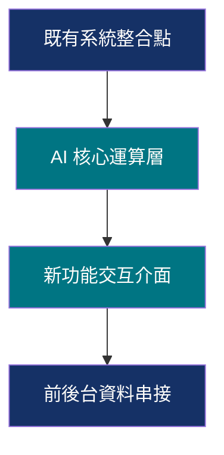
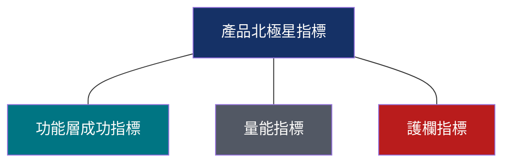
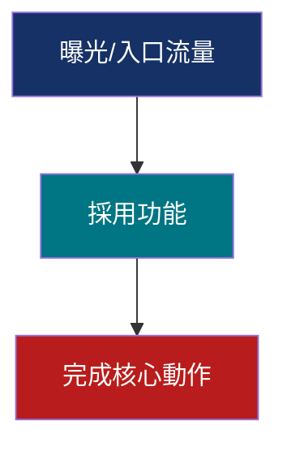

# 共用模組（Shared Modules）— 兩份 Slide Prompt Template 的維護端單一真實來源

> **這份檔案不是給使用者複製貼上用的。** 它是 `1_to_n_slide_prompt_template.md` 與
> `0_to_1_slide_prompt_template.md` 的共用邏輯維護來源。修改共用邏輯時，先改這裡，
> 再手動同步貼回兩份 template 中標記了 `<!-- SYNC: _shared-modules.md#<anchor> -->`
> 的對應區塊。

## 目錄

1. [指標定義與 Few-Shot](#module-1-指標定義與-few-shot)
2. [信心分級澄清機制](#module-2-信心分級澄清機制)
3. [雙重稽核官規則](#module-3-雙重稽核官規則)
4. [標題頁公式](#module-4-標題頁公式)
5. [Gamma 風格精簡指令](#module-5-gamma-風格精簡指令)
6. [Mermaid 流程圖策略](#module-6-mermaid-流程圖策略)

---

## Module 1: 指標定義與 Few-Shot

> **適用範圍**：北極星指標 (NSM)、量能指標 (Volume)、護欄指標 (Guardrail) 三者的定義與
> Few-Shot 對**兩份 template 完全共用**。功能層成功指標 (FSM) **僅 1-to-N 適用**，
> **0-to-1 嚴禁出現** —— 兩份 template 在下方各自的「1-to-N 結構合規」／「0-1 結構合規」
> 稽核準則裡各自保留這條差異規則，不要因為共用了指標定義就把 FSM 也共用進 0-to-1。

### 1. 產品北極星指標 (Product North Star Metric - NSM)

*   **定義**：度量產品核心價值向用戶兌現的單一領先指標。必須站在**需求面（用戶感受到的價值）**，代表用戶「真的體驗到價值」的最直接、最誠實的代理行為。
*   **廚房比喻**：**「每週吃光光盤的總數量」**（吃光代表顧客覺得東西好吃、體驗到食物價值的誠實身體行為；統計上只需數盤子，統計摩擦極低）。
*   **設計與稽核原則**：
    *   **價值實現代理**：用戶在系統點擊「生成」不代表感受到價值；必須是「匯出檔案」、「複製內容」或「分享給協作者」等代表內容已被人工檢視且即將進入下一步工作流的動作。
    *   **避開百分比陷阱**：產品北極星指標一律使用**「絕對計數」**，以衡量業務規模與實質用戶價值的總和。避免使用率或百分比。
    *   **硬性採用理由**：在簡報中必須詳細說明為什麼該指標代表核心價值的兌現，並解釋為什麼排除註冊數或營收等未能反映使用者實際感受價值的供給面/落後指標。
*   **Few-Shot 範例**：
    *   [反例] *供給面/未反映使用者價值*：每週 AI 生成 PRD 的總次數（用戶可能生成後立即刪除，未感受到價值）。
    *   [正例] *用戶感受價值*：每週成功**匯出**的 AI PRD 總數量（匯出代表內容已通過人工檢視且將進入下一步工作流；若擔心使用者為了「湊數」而匯出低品質內容，改用護欄指標把關品質，而非把「分享」這類次要行為混進北極星指標本身）。
    *   [反例] *落後/財務*：付費訂閱用戶數（無法指導產品改進的結果指標）。
    *   [正例] *用戶感受價值*：每週有進行內容分享的活躍 workspace 數量（協作行為改用護欄指標把關，不與分享行為混合計數）。

### 2. 功能層成功指標 (Feature Success Metric - FSM) —— 僅 1-to-N 適用

*   **定義**：用以量測該特定新增功能模組的採用與核心價值轉化。它必須同時包含**「採用該功能」**與**「體驗到主產品核心價值」**兩個要件，用以證明該功能如何發揮觸媒作用，拉動主產品的北極星指標。
*   **廚房比喻**：**「點了『AI 主廚推薦新菜』且吃光的顧客人數」**（同時滿足「點了新菜（採用功能）」且「吃光（核心價值實現）」）。
*   **設計與稽核原則**：
    *   **指標拉動理由**：必須說明此指標如何作為優化槓桿拉動主產品的北極星指標 (NSM)。
    *   **避開高摩擦動作**：在實務中，要求團隊成員對摘要進行留言或勾選的門檻極高。因此，改採「除建立者外的團隊瀏覽」作為低摩擦但有效的協作與對齊代理行為。
*   **Few-Shot 範例**（主產品：Notion 平台，其 NSM = 每週活躍協作文件數；新增功能：AI 會議記錄整理）：
    *   [反例] *虛胖指標*：AI 會議記錄功能點擊率（僅反映好奇心，不代表真實轉化）。
    *   [正例] *功能層成功*：每週生成的 AI 會議紀錄中，**在會後 48 小時內被 ≥ 2 位團隊成員瀏覽且完成行動清單勾選** 的比例（反映團隊真正利用此功能進行協作與任務對齊）。
*   **0-to-1 提案嚴禁使用**：在 **0-to-1 全新產品提案中，FSM 必須為 0（不加進簡報）**，因為新產品沒有大盤與子功能之分，引入 FSM 會造成高管觀念混淆。

### 3. 量能指標 (Volume Metric)

*   **定義**：度量漏斗最前端的入口流量與曝光採用次數，用以反映產品的採用規模。
*   **廚房比喻**：**「點擊且採用 AI 主廚推薦的總人數」**（漏斗最上游。如果點的人太少，就主產品無法被拉動）。
*   **設計與稽核原則**：
    *   **使用絕對計數**：量能指標必須是全域加總（如每週採用功能總次數），以避免被少數重度用戶或長 Session 灌歪的平均數。
    *   **硬性採用理由**：必須在簡報中說明此指標如何用來驗證漏斗前端的 Reach 與初步採用規模。
*   **Few-Shot 範例**：
    *   [反例] *易灌歪平均數*：每 Session 使用者平均提問次數。
    *   [正例] *全域加總*：每週總上傳分析的 PDF 文件數量。

### 4. 護欄指標 (Guardrail Metric)

*   **定義**：用於監控品質、安全、用戶疲勞度或系統副作用的防禦指標，用以**排除行為偽裝（防範指標存在被少數重度用戶或短期效應灌歪的風險）**。
*   **廚房比喻**：**「AI 主廚推薦菜的顧客 NPS 滿意度」** 或 **「新菜插入後 5 分鐘內的倒廚餘率/退餐率」**（排除顧客可能因為怕浪費、不好意思剩下而強行吃完的「假成功」）。
*   **設計與稽核原則**：
    *   **NPS 強制配對規則**：如果護欄指標採用了 **NPS (淨推薦值)** 等主觀問卷指標，**AI 必須硬性在旁邊多配對一個「行為日誌指標 (Behavioral Logs Metric)」**（例如：生成後 5 分鐘內的刪除率、人工作業二次修改輪數中位數、或還原率），作為雙重防守。
    *   **不一定是中位數**：中位數只是其中一種形式（如編修次數中位數）。護欄指標可以是用戶滿意度、短時間內的刪除率（Delete Rate）、還原率、或錯誤率。
    *   **可優化的比率/指標**：必須是**可量測、可優化的比率 (0-100%)** 或分數，具備清晰的改進方向，並避開 API 錯誤次數 = 0 等無法灰度迭代的絕對限制。
    *   **硬性採用理由**：必須在簡報中詳細說明此護欄指標是如何防止指標存在被灌歪風險的。
*   **Few-Shot 範例**：
    *   [反例] *絕對值門檻*：API 錯誤次數 = 0（無法衡量過程表現，無法進行灰度優化）。
    *   [正例] *可優化比率*：每週 AI 產出內容的**人工作業修正率**（如修改輪數超過 5 次的比例 ≦ 10%）。
    *   [反例] *偽問題*：系統未斷線率（若基礎建設已保證 99.9% 穩定，此指標無業務優化空間）。
    *   [正例] *品質護欄*：Verifier Agent 判定引用文獻 (Citations) 為 verified 的比例 ≧ 95%（直接為財務級審計把關品質）。

---

## Module 2: 信心分級澄清機制

> **適用範圍**：兩份 template 共用此機制的骨架（信心自評 → 分級動作），但**欄位清單依
> template 不同而不同**（見下方兩個變體）。此機制**取代**舊版「5 隻虛擬 Agent 共識會議 +
> 事後警告標籤」——虛擬共識會議本質是用更多推論掩蓋推論不足的問題，不構成真正的澄清；
> 信心分級 + 停止提問才是。

### 共用骨架

```text
1. 分析 spec.md 與 plan.md，針對下方欄位清單，各自給出 High / Medium / Low 三級信心：
   - High：文件中有**明確文字**指出答案。
   - Medium：文件中僅有**間接線索**，需要合理推論才能得出答案。
   - Low：文件中**完全沒有**可用線索，任何答案都等同於憑空杜撰。

2. 依信心分級決定動作，二選一：

   A. 若任一欄位為 Low：
      → 立即停止，不產出簡報大綱。一次性列出所有 Low 欄位的澄清問題（最多 5 題），
        每題附上「AI 推論候選值，請確認或修正」（不要用純開放式問句）；問題前先用
        一句話說明為什麼問這個（例如「因為 plan.md 沒提到這個功能屬於哪個產品」）。
        等待使用者回覆後才繼續產出。
      → 使用者可回覆「不用問我，直接用你的推論」跳過此步驟，一律改走 B。

   B. 若為 Medium 或 High：
      → 正常推論並產出完整簡報大綱，但直接寫出推論依據（用一句話說明「根據
        spec.md 第 X 段提到 Y，推論 Z」），並保留現有的警告標籤機制作為次要防線，
        不要用虛擬多 Agent 共識會議這種包裝手法假裝有嚴謹討論過程。
```

### 1-to-N 變體欄位清單（5 項）

1. 這個功能更新附屬的主產品名稱與定位（**注意**：spec.md/plan.md 中出現的 `P1`／`P2`／
   `P3` 等分期用詞，通常代表「同一個新產品的內部功能分期」，**不代表**一定存在既有主產品
   ——不要只因為看到版本化措辭就假設有主產品，這是已知的誤判風險）
2. 主產品現有的北極星指標定義
3. 北極星指標的目前基準值與目標值（數字；若文件只有定義沒有數字，此欄位視為 Low）
4. 這份簡報的受眾與使用場合（面試/內部匯報/對外提案等）
5. 這個功能/專案目前實際進度到哪個階段（規劃中/開發中/已上線；注意 P1-P4 是「規劃分期」
   不等於「實際完成進度」，兩者常被混淆）

### 0-to-1 變體欄位清單（4 項，無需判斷「主產品」因為本質是全新產品）

1. 這個全新產品的一句話定位與核心價值主張
2. 未來承諾的北極星指標定義（0-to-1 天生沒有目前基準值，不需要為此觸發提問）
3. 這份簡報的受眾與使用場合
4. 這個產品目前實際進度到哪個階段（規劃中/開發中/已有 Demo）

---

## Module 3: 雙重稽核官規則

> **理論依據**：本規則對應具名的 agentic design pattern（來源：
> `agentic-design-patterns` repo Ch.4 Reflection、Ch.6 Planning、Ch.7 Multi-Agent
> Collaboration、Ch.13 Human-in-the-Loop）：
> - 生產者／評審者角色分離，避免同一套生成邏輯自我審查時的認知偏差（Reflection）。
> - 評審意見衝突時走 Debate & Consensus，而非直接採信任一方（Multi-Agent Collaboration）。
> - 大綱先產出骨架再產出全文，用強制輸出格式取代語言指令（Planning）。
> - 稽核觸發條件用具體情境枚舉，不是模糊的「信心不足時」（Human-in-the-Loop）。

### 執行架構總覽（放在「智能體設計模式執行指南」章節開頭）

```text
本 prompt 採用**提示鏈（Prompt Chaining Pattern）**設計：將「產出一份稽核過的簡報」拆解
為一系列有明確依賴關係的子步驟，前一步的輸出是後一步的必要輸入，禁止跳步或合併步驟。

本 prompt 的步驟順序是**固定工作流（Fixed Workflow）**而非開放式動態規劃，因為簡報稽核
的「方法」已經是已知且固定的套路，不需要 LLM 自行摸索執行路徑。

在「草擬大綱」步驟中，採用強制型雙段輸出格式（Planning Pattern）：先輸出「### 大綱骨架」
（條列式，各頁核心論點），再輸出「### 完整內容」，避免邊寫邊想導致結構鬆散。
```

### 雙重稽核官的理論基礎（放在雙重稽核官關卡章節開頭）

```text
本 prompt 要求你在同一次生成中，依序扮演三個角色分離、身份互斥的智能體人格：
「草擬者（Producer）」→「稽核官 A：指標稽核官」→「稽核官 B：PM 總監稽核官」。這個設計
對應 Reflection Pattern：評審與產出角色必須分離，以避免同一套生成邏輯自我審查時的認知
偏差。兩位稽核官必須被賦予互斥且明確的評估標準，不是「請再檢查一次」這種模糊指令。

若兩位稽核官對同一頁面有衝突意見，進入 Debate & Consensus：雙方各陳述理由，草擬者需
綜合裁決並記錄裁決依據，而非直接採信任一方。

每輪稽核必須有明確的停止信號（兩位稽核官皆回覆 PASS），最多執行 2 輪；超過則標記為
「需人工判斷」並列出未解決爭議點，避免無限迴圈與 token 浪費。
```

### 第 4 綠燈：專業語域防護（Output Register Guardrail）— 加入 PM 總監稽核官清單

```text
`[G]` **專業語域防護**：以下詞彙**僅限本 prompt 內部推理與稽核說明使用**，**嚴禁出現在
最終輸出的簡報大綱、Slide 標題、條列內容、演講稿之中**（任何形式，包含加引號、加註解）：
「自嗨」「虛胖」「腦補」「洗版」「灌水」及其他口語化/非正式評判詞。若稽核官發現這些
詞彙滲透到對外可見的簡報文字，必須立即改寫為專業敘述後才能通過（例如：「自嗨指標」→
「未能反映使用者實際感受價值的供給面指標」；「指標虛胖」→「指標存在被少數重度用戶或
短期效應灌歪的風險」）。
```

### 拆鷹架寫作原則（放在「簡報 Storyline 結構」章節開頭）＋ 第 5 綠燈

> **來源**：`pm_proposal_presentation.pptx` Slide 3「REMOVE SCAFFOLDING NOISE / 排除框架
> 噪音」——鷹架（分析框架如雙鑽石模型、Persona、共情圖）是團隊內部梳理思路的工具，
> 房子蓋好時輔助用的鷹架就必須拆除，不該把分析框架本身當成簡報內容端給觀眾看。

```text
任何頁面若涉及使用者研究或痛點佐證，**嚴禁**以「空白分析框架」呈現內容（例如完整的
共情圖版面、雙鑽石模型圖、標準 Persona 卡片模板、放滿無關生活細節的用戶側寫）。改為
兩個具體策略（NN/g 去鷹架化建議）：

1.  **呈現洞察，隱藏模版**：不展示分析框架本身，直接引用一句最具代表性的使用者痛點
    原話或具體情境描述，把「洞察結論」推到最前面。
2.  **單一結論句標題**：所有 Slide 標題禁止使用「目錄名詞」（如「使用者訪談」「現狀
    分析」「Persona 側寫」），必須改寫為一句完整的結論主張。
```

```text
`[G]` **拆鷹架與洞察優先**：檢查是否有任何頁面殘留「空白分析框架」或「目錄名詞標題」。
若發現，需改寫為具體洞察引述與結論句標題後才能通過。
```

---

## Module 4: 標題頁公式

> **來源**：`pm_proposal_presentation.pptx` Slide 1/10/18 實測版式（封面頁與章節分節頁
> 共用同一版面公式）。

### 標題頁 / 封面頁規格（Cover Slide Specification）

在正式的大綱**之前**，必須額外生成一頁獨立的「Slide 0：封面頁」，作為整份簡報的開場：

*   **版面公式**：
    *   全頁滿版背景色（暖米白 `#FDFCFA`）。
    *   左側靠邊裝飾雙線（一粗一細的垂直線條，貼齊左邊界，幾乎頂滿全頁高度，營造書脊/裝訂感）。
    *   右上角與右下偏中各放一個大小不同的裝飾圓形色塊（大圓在右下、較小圓在右上，兩者不對稱錯位），使用 Brand Highlight 淡色調。
    *   文字內容一律靠左對齊，垂直排列，由上到下依序為：
        1.  Overline（英文全大寫分類詞，小字級、Brand Strong Teal `#007583`）
        2.  H1 主標題（可分 2-3 行的結論句/價值主張，大字級、Primary Navy 或 Deep Charcoal）
        3.  一句話副標說明（中等字級、次文字灰 `#525864`）
        4.  作者/單位落款（小字級、次文字灰 `#525864`，置於頁面下方）

### 對應 Gamma Prompt 輸出格式（插入大綱最前方）

```text
## Slide 0: [封面標題]
*   Layout: Title cover slide with asymmetric decorative circles (top-right
    small circle, bottom-right large circle) and a vertical double-line
    accent on the far left edge, spanning nearly full page height.
*   Overline (small caps, teal #007583): [PROJECT CATEGORY] PROPOSAL
*   H1 (large, 2-3 lines, navy #153166): [一句話核心主張，倒金字塔結論句]
*   Subtitle (medium, gray #525864): [一句話說明簡報目的]
*   Byline (small, gray #525864, bottom-left): [提案人] · [職稱] · [簡報用途]
```

---

## Module 5: Gamma 風格精簡指令

> **來源**：Gamma AI 能力調研（結論：Gamma 不會解析文字 prompt 裡的 hex 色碼與 inline
> SVG，色彩/字體應透過 Theme Editor / Brand Kit 一次性設定；風格指令應精簡為高層基調宣告）
> ＋ pptx 落差分析（強調色實測為 `#007583`，非原模板誤用的淺青色色階；缺次文字灰、頁尾、Overline）。

在生成的 Prompt 底部，必須附帶一組**精簡的風格制約**，以便直接複製到 Gamma 中：

1.  **主題基調 (Theme)**：Minimalist visual style, large typography, high contrast, airy layout with generous padding and margins (breathing room), based on `design-system-portfolio-site_6640.md`.
2.  **配色方案 (Colors)**（下方色碼供人工於 Brand Kit 一次性設定與對照使用；Gamma 生成時不保證會依文字 prompt 精確解析色碼）：
    *   頁面背景：暖米白 Warm Paper White (`#FDFCFA`)
    *   主標題與卡片框：深靛藍 Classic Navy (`#153166`)
    *   高亮強調／Overline／icon：深青 Brand Strong Teal (`#007583`)（**不是**舊版模板誤用的淺青色——那個色階只適合低透明度背景光暈，不適合前景文字/icon）
    *   次要強調（可選，次要 icon/次標題）：中青 (`#00969D`)
    *   主內文：深炭黑 Deep Charcoal (`#171C24`)
    *   次文字/輔助說明：石墨灰 Slate Gray (`#525864`)（新增；用於卡片說明文字、頁尾、輔助標籤等非主要強調的文字內容）
    *   警示/痛點：猩紅 Rose Crimson (`#B91C1C`)
3.  **排版限制 (Layout Constraints)**：
    *   嚴格禁止任何 Emoji，使用 Unicode 標點（如 `—`, `·`）或文字代替。
    *   排版極度要求呼吸感，禁止擁擠。
    *   採用「大數字 KPI 卡片」呈現首頁數據。
    *   使用「2欄/3欄拆分卡片」呈現用戶痛點與成功定義，代替長文字條列。
    *   **頁尾格式（每頁皆須有）**：頁面左下角固定顯示 `[簡報系列名稱英文] · PAGE [兩位數頁碼]`，字級極小，顏色為次文字灰 `#525864`。
    *   **Overline / Eyebrow（每頁標題上方皆須有）**：在 H1 標題正上方加一行全大寫英文分類詞，字級小、顏色使用 Brand Strong Teal `#007583`，用於標示這一頁在敘事鏈中的主題分類。
    *   **資料視覺化流程圖（與架構圖）**：見下方「Module 6：Mermaid 流程圖策略」，不再使用 SVG/CSS 語法。兩份 template 各自套用此規則時，依該 template 該頁是否兼指「架構圖」調整措辭（例如 1-to-N 為「流程圖與架構圖」，0-to-1 僅為「流程圖」）。
4.  **文字密度 (Text Density)**：Brief（物理簡練、視覺主導）。

### Brand Kit 一次性設定指引（非每次生成都要重複）

Gamma 不會可靠解析文字 prompt 裡的 hex 色碼與字體宣告——這些設定應透過 Gamma 的 **Theme Editor / Brand Kit** 介面一次性設定（色彩、字體、Logo），之後生成的每份簡報自動套用，不需要每次都在文字 prompt 裡重複列出精確色碼。文字 prompt 只需保留「延用品牌 Navy+Teal 配色」這類高層基調宣告即可。

### 生成後檢查清單（取代對 Gamma 一次到位的期待）

Gamma 對精細視覺規則（emoji 禁用、精確色階、字級層級）的遵循度不保證一次到位。使用者貼上 Prompt 生成後，應人工巡檢以下項目：
*   [ ] 是否有 Emoji 混入
*   [ ] 強調色是否偏離 Navy/Teal 基調
*   [ ] 是否有頁面資訊過度擁擠
*   [ ] 頁尾與 Overline 是否每頁一致

### Outline-first 使用提醒

貼上 Prompt 後，Gamma 會先產出一份中間大綱供審閱。**請先確認大綱結構無誤，再按下「生成完整簡報」**——修正大綱結構遠比事後重寫整份簡報的內容便宜，這是 Gamma 官方認可的效率作法。

---

## Module 6: Mermaid 流程圖策略

> **來源**：Gamma markdown 格式精確度調研（結論：Gamma 是 AI 生成引擎，不會照抄 markdown
> 版面，也不可靠渲染 inline SVG——寫死版面容易被誤判成資料表格）＋ pptx 落差分析（4 種
> 具體圖形語言：橫向編號步驟卡／Z字型技術管線／指標關係輪盤／漏斗圖）。**放棄**要求
> Gamma 自己畫圖，改為讓 template 直接產出一段 Mermaid 語法，使用者自行用 Mermaid 渲染
> 工具（如 mermaid.live）轉成圖片後手動插入/替換 Gamma 生成頁面對應位置。

不要要求 Gamma 自己生成精確的流程圖/架構圖——Gamma 是 AI 生成引擎，會對輸入做語意
二次詮釋，不保證還原任何精確版面，複雜的 inline SVG/CSS 也不會被渲染。改為：

1.  針對每一頁需要流程圖/架構圖的 Slide，依語意選擇下方其中一種 Mermaid 圖形類型，
    產出**獨立的 Mermaid 程式碼區塊**（不是塞進 Gamma 大綱文字裡）：

    *   **橫向編號步驟卡**（使用者互動流程用）：


    *   **Z 字型技術管線圖**（系統架構整合用）：



    *   **指標關係輪盤圖**（多指標互相拉動關係用）：



    *   **漏斗圖**（流量流失視覺化用）：



2.  Mermaid 圖表顏色**必須**遵守 `design-system-portfolio-site_6640.md` 的色彩 token：
    Primary Navy `#153166`、Brand Strong Teal `#007583`、次文字灰 `#525864`、警示
    Rose Crimson `#B91C1C`、背景 `#FDFCFA`。不要使用 Mermaid 預設配色。
3.  在 Gamma Prompt 輸出中，該 Slide 的大綱文字仍保留**一句自然語言描述**該頁圖表在
    講什麼（給 Gamma 排版文字用），但不要求 Gamma 自己畫出精確圖表。
4.  在最終輸出說明中，明確指示使用者：「請先用 Mermaid 渲染工具（如 mermaid.live）
    把上方這段圖表轉成圖片，再手動插入/替換 Gamma 生成的對應頁面」。

### 交付物封裝（Mermaid 渲染 + 統一輸出資料夾）

> **前提**：本節指令假設執行此 prompt 的 agent 具備 shell／檔案系統存取能力（例如
> Claude Code），而非單純的網頁聊天視窗。若執行環境沒有這類能力，請直接沿用上方
> 「使用者自行用 mermaid.live 渲染」的作法，跳過本節。

完成上方所有 Mermaid 圖表後，執行此 prompt 的 agent 必須：

1.  建立一個輸出資料夾：`./<簡報主標題 slug 化>-slide-package/`（例如簡報標題為
    「AI 會議記錄助理提案」，資料夾可命名為 `./ai-meeting-assistant-proposal-slide-package/`）。
2.  將最終 Gamma Prompt（含封面頁、大綱、演講稿、雙重稽核官關卡報告）完整寫入該資料夾內的
    `gamma-prompt.md`。
3.  對每一段 Mermaid 圖表：
    a.  將該圖表的 Mermaid 原始碼寫入對應的 `.mmd` 檔案（例如 `diagram-slide5.mmd`）。
    b.  用 mermaid-cli 渲染成 PNG：

```bash
npx -y @mermaid-js/mermaid-cli -i diagram-slideN.mmd -o diagram-slideN.png -b "#FDFCFA" -w 1600
```

        （`-b` 指定暖米白背景色以貼合品牌基調；`-w 1600` 提供適合簡報插入的解析度。）
    c.  若渲染失敗（例如環境沒有 node/npx 或指令執行錯誤），採**優雅降級**：保留該
        `.mmd` 檔案，並在 `gamma-prompt.md` 對應段落加註：
        `[PNG 渲染失敗，請自行至 mermaid.live 貼上 diagram-slideN.mmd 內容手動渲染]`。
4.  完成後，向使用者回報輸出資料夾的路徑，並附上使用說明：「請把 `gamma-prompt.md`
    貼進 Gamma 生成簡報，再依序把資料夾內的 PNG 圖片插入對應頁面」。
