<!--
  Vibe Coding Cookbook
  視覺：對齊 Airy Glass design system（navy 主色 + teal 強調 + 中性灰，主色 ≤5，Lucide icon，禁 emoji）
  Icon 語法：{{icon:名稱}} 於渲染階段換成 Lucide SVG
-->

# Vibe Coding Cookbook
### 給初心者的 0→1 實務流程：從一個念頭，到上線維運

---

## Part 0 · 如何使用本文件

### 這份文件是什麼

這是一份**操作手冊（cookbook）**，不是教科書。它教你一件具體的事：

> 用 AI coding agent，把一個**還在腦中的念頭**，一路做到**正式上線、能被使用、出錯能修**。

市面上談「vibe coding」的文章很多，但多半停在「叫 AI 寫個小東西」。這份文件不一樣——它帶你走完**真實產品都會經歷的七個環節**，每一步都告訴你：**用哪個工具、貼哪段提示詞、怎麼確認你做對了**。

### 這份文件給誰

寫給 **vibe coding 初心者**：你會用 AI 聊天、可能寫過一點程式、但還沒有「自己一個人把產品做到上線」的完整經驗。你不需要是工程師。

### 你做完會得到什麼

- 一套**可重複套用到任何產品**的 0→1 工作流程（這才是重點）。
- 一份**能直接複製貼上的提示詞清單**，照著就能驅動 AI 完成每個環節。
- 一個真實跑過的範例：一個**法規問答 AI**，從零做到上線。

> {{icon:lightbulb}} **這是一份談方法論的文件，不是一份「教你做問答 AI」的文件。**
> 全文用「法規問答 AI」當範例，只是因為它夠完整、能示範每個環節。你學的是**流程與心法**，範例隨時可以換成你自己的點子。

### 本文件地圖

先看全貌，你才不會在中途迷路。整份文件分成五個部分，核心是 **Part 3 的七個環節**：

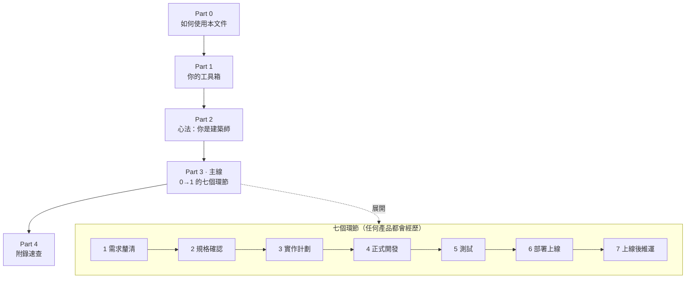

| 部分 | 在解決什麼 | 你該怎麼讀 |
|---|---|---|
| **Part 1 · 你的工具箱** | 「我手上到底有哪些武器？」 | 進主線前先掃一遍，知道每個工具是幹嘛的 |
| **Part 2 · 心法** | 「為什麼我不能全交給 AI？」 | 認真讀，這決定你會不會踩大坑 |
| **Part 3 · 七個環節** | 「實際上一步一步怎麼做？」 | 主線，照順序走；每環節都有可複製提示詞 |
| **Part 4 · 附錄** | 「我想快速查某個提示詞 / 解某個錯誤」 | 隨查，不必從頭讀 |

### 怎麼讀這份文件

- **主線優先**：跟著 Part 3 的七個環節順序走，照抄提示詞就能跑通。第一次讀，不要岔出去。
- **進階收在可選層**：標示為「深入理解」的段落是**選讀**——不讀也能完成任務，想懂原理再展開。
- **看標記選深淺**：每個環節開頭都標了**預估時間**與**難度**，你可以自己決定要做到多細。

### 全文件慣例（先認得這些記號）

讀任何一個環節，你都會看到這幾種固定區塊。它們長一樣、放一樣的位置，認得一次就一勞永逸：

| 記號 | 意思 | 你該做什麼 |
|---|---|---|
| {{icon:clipboard}} **複製提示詞** | 一段可直接複製貼給 AI 的提示詞 | 複製、填好空格、貼給你的 AI |
| {{icon:circle-check}} **預期結果** | 這一步做完該看到什麼 | 對照確認，沒看到就別往下走 |
| {{icon:triangle-alert}} **注意 / 踩坑** | 初學者最常出錯的地方 | 停下來看一眼，能省你很多時間 |
| {{icon:lightbulb}} **深入理解** | 原理與「為什麼」（選讀） | 想懂再讀，趕進度可略過 |
| {{icon:wrench}} **疑難排解** | 卡住了怎麼辦 | 出問題時再回來查 |
| {{icon:arrow-right}} **下一步** | 這個環節結束，接著去哪 | 跟著走到下一環節 |

#### 提示詞與「填空」怎麼用

本文件的提示詞都長這樣——**用尖括號標起來的是你要替換的空格**：

```text
請幫我規劃一個 <你的產品一句話描述> 的開發計畫，
目標使用者是 <你的目標使用者>。
```

填空範例（把空格換成你自己的內容）：

```text
請幫我規劃一個 給上班族的法規問答 AI 的開發計畫，
目標使用者是 不熟法律、需要快速查勞基法的 HR。
```

> {{icon:triangle-alert}} **注意**：尖括號 `< >` 和裡面的提示文字都要一起換掉，不要把括號留著貼給 AI。

### 每個環節長什麼樣（固定結構）

為了讓你「讀第二個環節就知道東西放在哪」，七個環節都用同一套結構：


### 成品預覽

走完七個環節，你會親手把這個東西送上線：

> **法規問答 AI**：使用者輸入一個法規問題，AI 從你上傳的法規語料中找答案，並**附上引用的條文出處**；每次問答會被記錄下來，使用者還能對答案評分。

<!-- TODO: 放最終成品截圖（問答介面 + 引用來源卡片）。截圖於 Part 3 環節 6 完成後補上。 -->

準備好了嗎？先去 **Part 1 認識你的工具箱**，我們在那裡盤點你手上所有的武器。

> {{icon:arrow-right}} **下一步**：Part 1 · 你的工具箱

---

## Part 1 · 你的工具箱

進主線之前，先認識你手上有哪些武器。**你不需要背下來**——只要知道「遇到什麼問題，該拿哪一個出來」。這一章就是一份隨查的清單。

### 先搞懂三個詞：skill、tool、MCP

這份文件會一直出現這三個詞，先用一句話分清楚：

| 詞 | 白話解釋 | 比喻 |
|---|---|---|
| **skill（技能）** | 一份「教 AI 把某件事做好」的專業說明書。你叫出某個 skill，AI 就照那套流程走 | 給 AI 的**標準作業手冊** |
| **tool（工具）** | AI 能直接動手做的動作，例如搜尋網路、執行指令、讀寫檔案 | AI 的**手腳** |
| **MCP** | 一種「讓 AI 連到外部服務」的標準接頭。透過它，AI 能直接查文件、開瀏覽器、讀錯誤報告，不用你手動複製貼上 | AI 接到外部世界的**插座** |

> {{icon:lightbulb}} **深入理解**：MCP 全名 Model Context Protocol，是一套讓 AI 連到外部服務的共通標準。關鍵觀念——**MCP 是「tool」的一種實踐形式，但不是所有 tool 都是 MCP**：像 Web Search、執行終端機指令也是 tool，卻不透過 MCP；而 Context7、Playwright、Sentry 這些「需要連到外部服務」的能力，就以 MCP 的形式提供。你只要把 MCP 想成「裝了這個接頭，AI 就多一項連外能力」即可。

### 怎麼安裝這些工具

在 Claude Code 裡，skill / tool / MCP 大多以 **plugin（外掛）** 的形式安裝。分兩種情況：

**情況 A · 官方 plugin 商店裡有**

1. 在 Claude Code 輸入 `/plugin`，瀏覽商店、找到你要的 plugin 並安裝。
2. 安裝後輸入 `/reload-plugins` 完成啟用。
3. 再輸入一次 `/plugin`，**double check 確認該 skill / tool / MCP 是 enable（啟用）狀態**。

**情況 B · 官方商店裡沒有**

1. 上網搜尋這個 skill / tool / MCP 的 **GitHub repo**。
2. 進到 repo 頁面，點右上角綠色 **Code** 按鈕，複製它的 repo 網址（如下圖）。
3. 把網址貼給你的 coding agent，請它**依照該 repo 的 `README.md` / `CLAUDE.md` / `AGENTS.md` 完成安裝**。
4. 安裝後輸入 `/reload-plugins` 完成啟用。
5. 再輸入一次 `/plugin`，**double check 確認該 skill / tool / MCP 是 enable（啟用）狀態**。

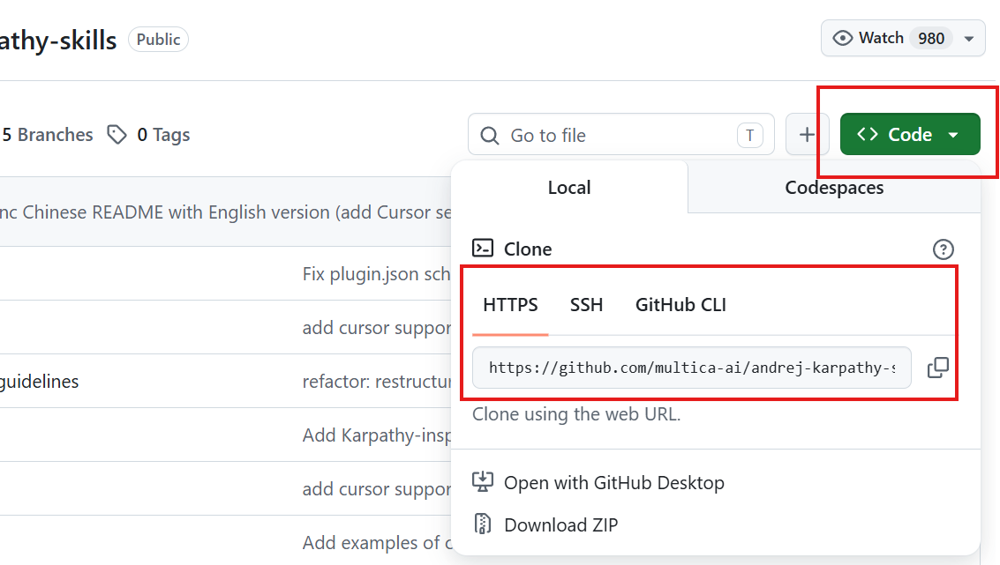

> {{icon:triangle-alert}} **注意**：不論用哪種方式，安裝完都記得輸入 `/reload-plugins` 才會生效。

> {{icon:clipboard}} **複製提示詞**（情況 B 用，把網址貼給 agent）
> ```text
> 請依照這個 repo 的 README.md / CLAUDE.md / AGENTS.md，
> 幫我把它安裝成 Claude Code 的 plugin：
> <你複製的 GitHub repo 網址>
> 安裝完成後告訴我，我會執行 /reload-plugins 啟用。
> ```

---

### 一、工作紀律類：讓 AI 有章法

這類 skill 不直接產出功能，但它們是**全程的地基**——決定了 AI 是「失控亂寫」還是「像個可靠的資深工程師」。

| 名稱（skill） | 解決什麼問題 | 它是什麼 | 環節 |
|---|---|---|---|
| **using-superpowers** | AI 不知道自己其實有一整套技能，只會即興發揮 | superpowers 的總開關：讓 AI 快速認得「自己手上有一大套 superpower skills」，動手前隨時可叫它 check 有沒有對應的 skill 該用 | 全程 |
| **brainstorming** | 一有點子就開工，做到一半才發現方向錯 | 強迫「先想清楚再動手」：一次問你一個問題，把模糊念頭逼成明確需求與設計，談定前不准寫程式 | 1 |
| **writing-plans** | 規格與計畫含糊，開發越做越偏 | 把需求落成白紙黑字的 `spec.md`（規格）與 `plan.md`（開發計畫） | 2、3 |
| **TDD**（test-driven-development） | 不知道何謂「完成」、改 A 壞 B 沒人發現 | 先寫測試再寫實作：先定義「成功長怎樣」，改壞了測試會立刻抓到 | 4 |
| **systematic-debugging** | 一卡 bug 就亂試、瞎猜 | 有方法的除錯：先重現、再找根因，而非急著套補丁 | 4、7 |
| **dispatching-parallel-agents** | 研究/開發一件件排隊太慢、容易漏 | 把多個獨立任務同時派給多個 AI 分身平行處理，追求速度與覆蓋（本文件的前置研究就是這樣做的） | 1、3、4 |
| **code review**（requesting / receiving） | 沒人檢查 AI 產出就上線 | 請 AI 以審查者角度找問題，並教你如何正確消化審查意見（而非照單全收） | 4 |
| **karpathy-guidelines** | AI 過度設計、改動失控、藏假設不講 | 一組行為準則：最小改動、不做沒被要求的功能、講清假設、先定義可驗證的成功條件 | 全程 |

### 二、研究與文件類：讓 AI 講對的話

| 名稱 | 解決什麼問題 | 它是什麼 | 環節 |
|---|---|---|---|
| **Context7**（MCP） | AI 知識有訓練截止日，幻覺出不存在/已棄用的 API | 即時抓**最新、版本正確**的官方技術文件餵給 AI；寫某框架/SDK 前先查，大幅減少用到過時 API | 1、3、4 |
| **Web Search**（tool） | 閉門造車，不懂使用者與市場 | 讓 AI 上網蒐集資料；本文件用於研究 **NNgroup** 的 UI/UX 準則，與**國內外近似產品分析** | 1 |

### 三、設計類：讓成品不像 AI 隨手生成

| 名稱 | 解決什麼問題 | 它是什麼 | 環節 |
|---|---|---|---|
| **frontend-design**（skill） | 畫面醜、千篇一律、一看就是 AI 通用樣板 | 專做**有質感**前端：先做設計決策（配色、字體、間距），再落地成程式碼 | 1、4 |
| **visual companion**（brainstorming 的視覺功能） | 需求/設計用講的講不清，雙方想的不一樣卻不自知 | brainstorming 中 AI 直接在瀏覽器畫 mockup、版型比較圖，讓你**邊看邊改** | 1 |

### 四、測試與瀏覽器類：讓 AI 自己開瀏覽器驗證

| 名稱 | 解決什麼問題 | 它是什麼 | 環節 |
|---|---|---|---|
| **playwright-cli**（skill） | 不確定做出來的東西能不能跑 | 教 AI 用終端機指令操控瀏覽器（開頁、填表、截圖）；比 MCP **更省 token**，適合快速檢查、debug | 5、7 |
| **playwright-core**（skill） | 不會寫「不會時好時壞」的穩定 E2E 測試 | 一套實戰驗證的 Playwright 測試寫法（選元素、斷言、登入、網路處理） | 5 |
| **Playwright MCP**（MCP） | 需要 AI **真的開瀏覽器**去點、看、重現問題 | 把瀏覽器操作做成 AI 可呼叫的接頭；用網頁「無障礙樹」理解畫面，比截圖座標可靠 | 5、7 |

### 五、部署與維運類：讓上線不再可怕

| 名稱 | 解決什麼問題 | 它是什麼 | 環節 |
|---|---|---|---|
| **Railway**（tool：CLI + GitHub-CICD） | 部署、資料庫、環境變數對新手是三座大山 | 新手友善的雲端平台：CLI 直接開 Postgres、設變數、看日誌；部署走 GitHub 連結，push 後自動上線，幾乎不碰後台 | 6 |
| **Sentry**（MCP + Seer） | 上線後使用者出錯你卻不知道，更別說修 | 錯誤監控：MCP 把生產真實錯誤帶進 AI，Seer 做根因分析並建議修法，讓 AI 拿著真實錯誤直接修 | 7 |

---

### 環節 ↔ 工具 總覽地圖

把上面所有武器，對應到你接下來會走的七個環節。**這就是你的作戰地圖**——進到任何環節，回來查這裡就知道該拿什麼出來。

先用一張圖看「每個環節主要靠哪些工具」（`using-superpowers` 與 `karpathy-guidelines` 貫穿全程，是底層紀律）：

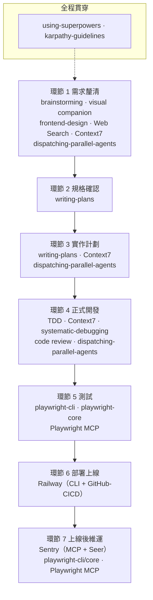

對照表（隨查版）：

| 環節 | 主要 skill / tool / MCP |
|---|---|
| **1 · 需求釐清** | brainstorming、visual companion、frontend-design、dispatching-parallel-agents、Web Search（NNgroup + 近似產品分析）、Context7 |
| **2 · 規格確認** | writing-plans |
| **3 · 實作計劃** | writing-plans、Context7、dispatching-parallel-agents |
| **4 · 正式開發** | TDD、Context7、systematic-debugging、karpathy-guidelines、code review、dispatching-parallel-agents |
| **5 · 測試** | playwright-cli、playwright-core、Playwright MCP |
| **6 · 部署上線** | Railway（CLI + GitHub-CICD） |
| **7 · 上線後維運** | Sentry（MCP + Seer）、playwright-cli、playwright-core、Playwright MCP |
| **全程貫穿** | using-superpowers、karpathy-guidelines |

> {{icon:arrow-right}} **下一步**：Part 2 · 心法——在開始動手前，先建立「你是建築師，不是旁觀者」的正確心態。

---

## Part 2 · 心法：你是建築師，不是旁觀者

這一章不教任何工具。但它決定你做出來的是「**能用的產品**」，還是「**看起來能用、一上線就爆**」的東西。動手前，請務必讀完。

### 先說清楚：vibe coding 不是「放手不管」

「vibe coding」這個詞，是 Andrej Karpathy 在 2025 年初隨手發的一則貼文——意思是「完全交給感覺、接受 AI 的所有產出、甚至不看程式碼」。但**他講的適用範圍，是『丟棄式的週末玩具專案』**，從來就不是拿來做要上線的真實產品。

> {{icon:triangle-alert}} **注意——最常見的觀念錯誤**：「用 AI 輔助寫程式」≠「vibe coding」。
> 如果 AI 幫你寫了每一行，但你**已經審查、測試、理解**了全部——那不是 vibe coding，而是把 AI 當成一個高效的助理。**這份文件教的正是後者**：有紀律地用 AI，把產品做到能安心上線。別被名字騙了。

### 核心觀念：差別不是工具，是知識

同樣一句提示詞、同樣的 AI，有人做出能上線的產品，有人做出一上線就漏資料的地雷。差別不在工具，在**你是用什麼心態在用它**：

| | 旁觀者（純 vibe coder） | 建築師（你該成為的） |
|---|---|---|
| 心態 | 「AI 生出來能跑就好」 | 「我決定要蓋什麼，並檢查每個關鍵結構」 |
| 對產出 | 直接按 Accept，不看 | 像審查資淺同事的程式碼一樣讀過 |
| 出錯時 | 把錯誤丟回去叫 AI 再試 | 先要 AI 用白話解釋問題，理解了再修 |
| 結果 | 祈禱沒人畫的藍圖蓋出的房子別倒 | 知道房子為什麼站得住 |

> {{icon:lightbulb}} **一句話**：AI 是加速器，不是工程紀律的替代品。它讓你更快，但**方向與品質的責任，永遠在你身上**。

### Karpathy 四原則：給 AI 的工作紀律

這四條是 `karpathy-guidelines` skill 的核心，貫穿後面每個環節。你不必背，但要認得它們的精神：

| 原則 | 白話 | 怎麼落地 |
|---|---|---|
| **先思考再寫** | 不確定就問，不要默默假設 | 要 AI 先講清楚假設與做法，有多種解讀時全部列出，你選定才動工 |
| **避免過度工程** | 用「能解決問題的最小程式碼」 | 明講「不要做我沒要求的功能、抽象、設定」 |
| **外科手術式修改** | 只動該動的地方 | 要 AI 產出後自審 diff、為每個改動辯護，砍掉無關更動 |
| **目標驅動的迴圈** | 先定義「成功」，再讓 AI 跑到達標 | 不說「修這個 bug」，而說「先寫一個能重現 bug 的測試，再讓它通過」 |

### 最危險的陷阱：看似合理的錯誤

初學者最大的風險，不是 AI 給出**明顯**的錯——那種你一眼看得出來。真正危險的是 **90% 對、10% 微妙錯**的產出，它能通過你每一次點擊測試，因為表面上「看起來都對」。常見的有：

- **錯誤處理被靜默跳過**：AI 寫了 `catch` 卻什麼都沒做，出錯時畫面正常、但其實沒做你要的事。
- **認證只做了 happy path**：能登入就好，卻沒處理 session 過期、權限控管。
- **把密鑰硬編碼進程式**：API key 直接寫死、甚至放到前端，一上線就外洩。

> {{icon:triangle-alert}} **注意**：研究指出約 45% 的 AI 生成程式碼含有漏洞。這不是要你不用 AI，而是要你**知道哪裡該多看一眼**。

### 何時必須停下來、把程式碼搞懂

主線大部分時候你可以「先照抄跑通、再回頭理解」。但有四條**紅線**，碰到時一定要停下來，搞懂了才上線：

- {{icon:wrench}} **安全與認證**：登入、權限、Token。
- {{icon:wrench}} **金錢與付款**：任何跟錢有關的邏輯。
- {{icon:wrench}} **使用者資料**：個資的儲存、刪除、權限。
- {{icon:wrench}} **部署設定**：環境變數、密鑰、對外網域。

### 每次讓 AI 動手，都走這個循環

把上面所有原則濃縮成一個你可以反覆套用的循環——**Plan、Act、Verify**：

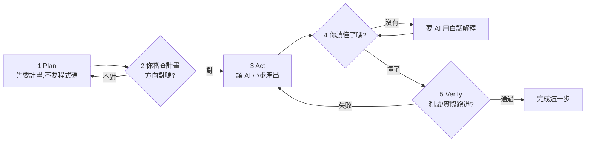

> {{icon:lightbulb}} **深入理解**：這個循環的精神是「**小步前進、保持在控制中**」。每一步都小到你能讀懂、能驗證；做錯了也只錯一小步，容易退回。這正是「建築師」與「旁觀者」最實際的分界線。

### 給初學 vibe coder 的七條心法

| # | 心法 |
|---|---|
| 1 | **你是建築師，不是旁觀者**——方向與品質的責任在你。 |
| 2 | **像審查資淺同事一樣**審查 AI 的產出，別只按 Accept。 |
| 3 | **先要計畫，再要程式碼**——審過思路才讓它實作。 |
| 4 | **小步前進**——把大功能拆成小而具體的請求。 |
| 5 | **測試是驗證，不是裝飾**——你仍要確認產出正確、安全。 |
| 6 | **壞掉時先要白話解釋**，理解問題再修，不要急著套補丁。 |
| 7 | **碰到紅線就停下來**——安全、金錢、資料、部署，搞懂再上線。 |

帶著這個心態，我們開始走真正的流程。

> {{icon:arrow-right}} **下一步**：Part 3 · 主線——從環節 1「需求釐清」開始。

---

## Part 3 · 主線：0→1 的七個環節

從這裡開始，我們真的動手了。接下來七個環節，是**任何產品都會經歷的開發生命週期**——照順序走即可。

- 每個環節都用**同一套結構**：成果 → 你需要先有 → 流程概覽 → 步驟（含可複製 prompt）→ 完成檢查 → 疑難排解 → 下一步。
- 範例一律用「**法規問答 AI**」貫穿。讀的時候，**心裡把它換成你自己的點子**就好。
- 提示詞都可直接複製；記得替換 `< >` 裡的空格。

---

### 環節 1 · 需求釐清（需求細節 + 視覺）

> **成果**：一份釐清過的需求重點 + 一個看得到的前端 mockup 方向　｜　**時間**：約 1–2 小時　｜　**難度**：低

這是 0→1 的第一步，也是最容易被初心者跳過、卻最不該跳過的一步。**方向錯了，後面做再快都是白做。** 這個環節的目標只有一個：把腦中模糊的念頭，變成「講得清楚、有研究支撐、看得到畫面」的需求。

#### 你需要先有

- [ ] 一個**還很粗略**的點子（一句話也行）。
- [ ] 已安裝並啟用：`brainstorming`、`frontend-design`、`dispatching-parallel-agents` skill，以及 `Context7`、`Web Search`（`visual companion` 隨 brainstorming 內建）。
- [ ] 不確定怎麼裝？回去看 Part 1 的「怎麼安裝這些工具」。

#### 這個環節怎麼走

我們採「**研究前置**」：先讓 AI 派多個分身平行把資料查滿，再帶著真實資訊陪你釐清需求，最後把畫面也變具體。

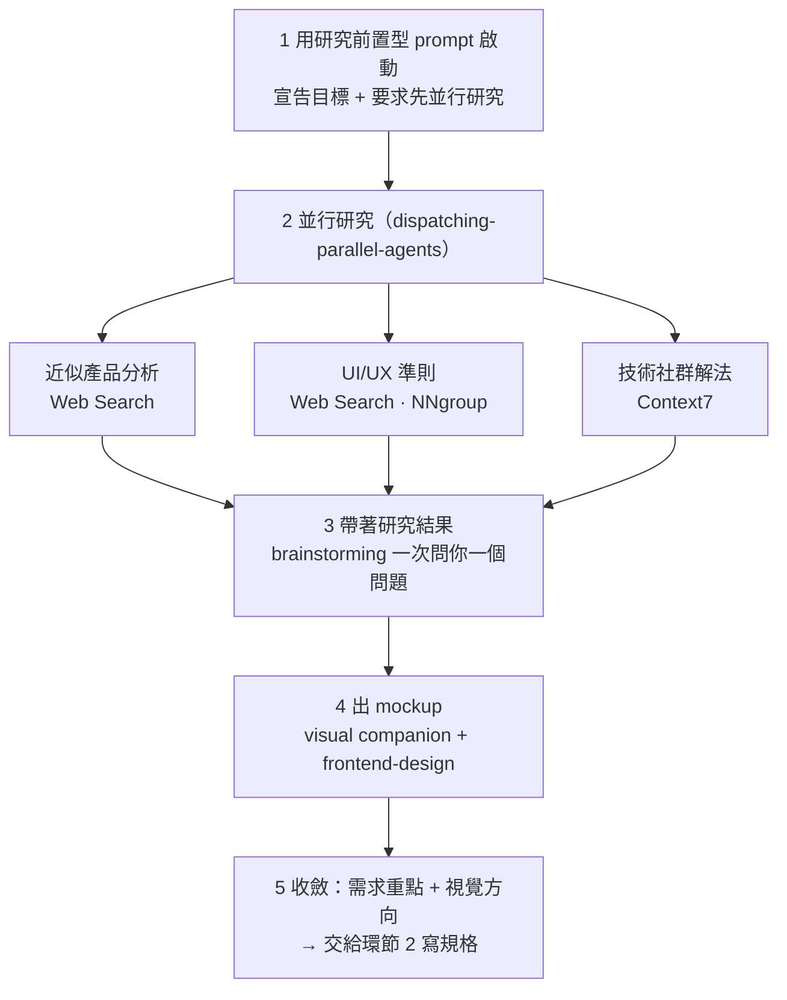

#### 步驟

**步驟 1 · 用「研究前置型」啟動，並同時派出並行研究**

把下面這段貼給 AI。它會**先派多個 agent 並行研究**，再回來陪你釐清需求。

> {{icon:clipboard}} **複製提示詞**（替換 `< >` 後使用）
> ```text
> 我想用 brainstorming skill 和你討論，產出 <你的產品一句話描述>。
>
> # 目標
> <這個產品要幫誰、解決什麼問題>
>
> # 會用到的 skill / tool
> - skill：brainstorming、frontend-design
> - tool：Context7、Web Search
>
> # 在開始需求訪談前，先做研究（這步不要省）
> 請先使用 dispatching-parallel-agents skill，盡可能多派 agent 並行研究：
> - 國內外近似產品分析：找 3–5 個類似的產品，分析核心功能、優缺點、使用者評價
> - NNgroup（nngroup.com）關於 <你的關鍵介面，例如：問答 / 對話介面> 的 UI/UX 設計準則
> - 用 Context7 探查技術社群對「<你的核心技術需求>」的主流解法與推薦做法
> 研究完把重點整理回來。
>
> # 協作方式
> 研究完，再用 brainstorming skill 一次問我一個問題釐清需求，
> 談定前先別寫任何規格或程式。
> ```

填好空格長這樣（法規問答 AI 範例）：

> {{icon:circle-check}} **填空範例**
> ```text
> 我想用 brainstorming skill 和你討論，產出 一個給民眾查詢勞動法規的問答 AI。
>
> # 目標
> 幫不熟法律的上班族 / HR，用自然語言問勞基法問題，AI 從法規條文找答案並附上條文出處。
>
> # 會用到的 skill / tool
> - skill：brainstorming、frontend-design
> - tool：Context7、Web Search
>
> # 在開始需求訪談前，先做研究（這步不要省）
> 請先使用 dispatching-parallel-agents skill，盡可能多派 agent 並行研究：
> - 國內外近似產品分析：找 3–5 個類似的法規 / 法律問答產品，分析核心功能、優缺點、使用者評價
> - NNgroup 關於 問答 / 對話介面 的 UI/UX 設計準則
> - 用 Context7 探查技術社群對「法規長文件的 RAG 問答」的主流解法（例如 OpenAI file search）
> 研究完把重點整理回來。
>
> # 協作方式
> 研究完，再用 brainstorming skill 一次問我一個問題釐清需求，談定前先別寫任何規格或程式。
> ```

**步驟 2 · 帶著研究結果，讓 brainstorming 一次問你一個問題**

研究回來後，AI 會用 brainstorming **一次問你一個問題**，把需求逐步釐清。你的任務是**誠實回答、有想法就講、不確定就說不確定**。

> {{icon:triangle-alert}} **注意**：如果 AI 跳過提問、直接開始寫規格或程式，把它拉回來——「先別寫，繼續用 brainstorming 一次問我一個問題。」釐清沒完成前，不要讓它往下衝。

**步驟 3 · 把視覺需求變具體：用 design.md 當設計準則出 mockup**

需求文字釐清得差不多，就讓 AI 把「畫面長什麼樣」變成看得到的 mockup。

> {{icon:triangle-alert}} **注意——這是初心者最容易踩的坑**：如果你只丟一句「用 frontend-design skill 幫我做 mockup」，因為**缺乏明確的設計指引**，AI 每次產出的品質都像**健達出奇蛋——打開才知道**：風格飄移、不一致、時好時壞。
> **解方：給它一份 `design.md` 當「設計準則」。** design.md 是一份嚴格規定顏色、字體、間距、圓角的設計規格檔；AI 照著做，產出才會穩定、專業、一致。

取得 design.md 有兩條路：

##### 做法 A · 下載現成的 design.md（建議，最簡單）

社群已經有人把知名產品的設計語言整理成現成的 design.md，直接下載套用即可。以 **[getdesign.md](https://getdesign.md/)** 為例：

1. **下載 design.md**——挑一套你喜歡的設計（例如 Stripe），點 **Download DESIGN.md**（或執行它提供的 `npx getdesign@latest add <名稱>`）。

   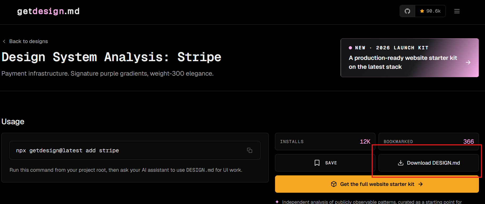

2. **拖進專案資料夾**——把下載的 `DESIGN.md` 拖曳到你的 VSCode 專案資料夾裡。

   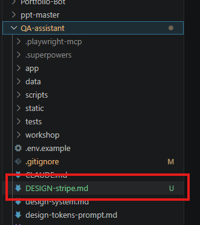

3. **指定它為設計準則，請 AI 出 mockup**——把下面這段貼給 AI。**小技巧：用半形 `@` 可以直接指定檔案**（例如 `@DESIGN-stripe.md`）。

   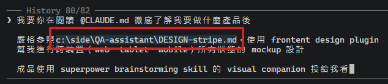

   > {{icon:clipboard}} **複製提示詞**
   > ```text
   > 請先閱讀 @CLAUDE.md，徹底了解我要做的產品。
   > 接著嚴格參照 @<你的 design.md，例如 DESIGN-stripe.md>，
   > 使用 frontend-design skill 幫我做出跨裝置（web / tablet / mobile）、
   > 涵蓋所有狀態的 <你的主要畫面，例如：問答介面> mockup。
   > 成品請用 brainstorming 的 visual companion 投到瀏覽器給我看。
   > ```

4. **用 visual companion 檢核微調**——AI 會把 mockup 投到瀏覽器，你**邊看邊調**（哪裡太擠、想走哪個方向），不必會設計，只要會說「這個太擠」「想更專業一點」。

   

##### 做法 B · 自行打造專屬的 design.md（費時，但持久、好維護）

想要獨一無二、能長期重用的品牌設計，可以自己做一份 design.md。這比較花時間，完整做法收在 **附錄〈自行打造你的 design.md〉**。

> {{icon:lightbulb}} **小技巧：讓 NNgroup 研究來「驅動」設計決策**
> `design.md` 解決的是「整體視覺風格」，但有些**具體互動該怎麼設計**——例如「條文全文該用側邊抽屜（drawer）還是手機底部 sheet？」「該不該用 modal？」——光靠風格檔答不出來。
> 這時可以叫 AI 去 **Web Search 研究 NNgroup（nngroup.com，公認的使用者體驗聖經）** 再回來設計；要同時查多個 UX 主題時，搭配 `dispatching-parallel-agents` 一次派多個研究 agent。
>
> 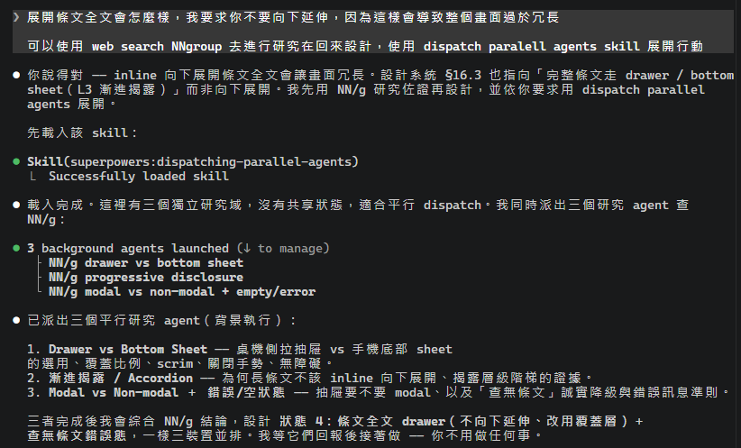
>
> AI 會把 NN/g 的研究結論套用到 mockup，產出**有 UX 依據**的跨裝置設計：
>
> 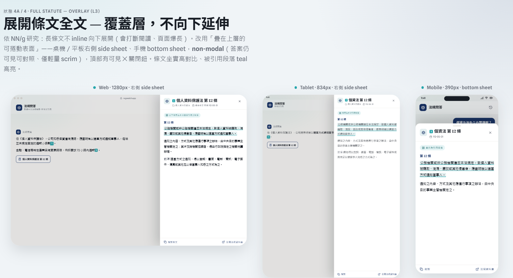
>
> {{icon:clipboard}} **複製提示詞**
> ```text
> 這個畫面的 <某個互動，例如：展開條文全文> 我不確定怎麼設計最好。
> 請先用 Web Search 研究 NNgroup（nngroup.com）對這類互動的建議，
> 需要查多個主題時，用 dispatching-parallel-agents 同時派多個 agent 查，
> 再根據研究結論調整 mockup。
> ```

> {{icon:lightbulb}} **深入理解：design.md 裡到底「嚴格規定」了什麼？**
> 以 `DESIGN-stripe.md` 為例，它用結構化格式把設計語言**定死**，讓 AI 無從亂猜：
> - **顏色 colors**：primary、ink（文字）、canvas（底色）、hairline（分隔線）… 每個都給確切色碼。
> - **字體 typography**：display / heading / body 各級的字型、字級、字重、行高、字距（例如 Stripe 的招牌——weight 300 細體 + 負字距）。
> - **間距、圓角、陰影、元件樣式**：按鈕圓角、卡片表面、陰影強度都規範好。
>
> 一句話：**design.md = 設計的「唯一真相」**，AI 只能引用、不能自己發明，產出自然一致。

#### 完成檢查（Checkpoint）

全部打勾，才往下一個環節走：

- [ ] **需求重點**寫下來了：要做什麼、給誰、核心功能、**明確不做什麼**。
- [ ] 三份**研究結論**到手：近似產品分析、UI/UX 準則、技術解法。
- [ ] 已選定一份 `design.md` 並放進專案、被 AI 引用（做法 A 下載 或 做法 B 自製）。
- [ ] 有一個**看得到的 mockup 方向**。
- [ ] 你能用**一句話**說出「這個產品幫誰解決什麼問題」。

#### 疑難排解

| 症狀 | 可能原因 | 怎麼辦 |
|---|---|---|
| AI 直接開始寫規格 / 程式 | 它跳過了釐清階段 | 明確說「先別寫，繼續用 brainstorming 一次問我一個問題」 |
| 研究結果太籠統、沒重點 | prompt 沒指定面向與數量 | 指定「找 3–5 個」「分析功能 / 評價 / 優缺點」等具體面向 |
| brainstorming 問題太發散 | 沒聚焦 | 請它「先聚焦核心功能與目標使用者，其餘延後」 |
| mockup 每次風格不一致（健達出奇蛋） | 沒給設計準則，AI 只能亂猜 | 下載或指定一份 `design.md`，要 AI 嚴格參照它 |
| mockup 不滿意 | visual companion 本來就要邊看邊改 | 直接說哪裡不對、想要什麼風格，請它重畫 |

> {{icon:arrow-right}} **下一步**：環節 2 · 規格確認——把釐清好的需求，落成白紙黑字的 `spec.md`。

---

### 環節 2 · 規格確認

> **成果**：一份你審閱確認過的 `spec.md`（規格書）　｜　**時間**：約 30–60 分鐘　｜　**難度**：低

環節 1 把需求釐清在「對話」裡——但對話會忘、會飄。這個環節要把它**固定成白紙黑字的 `spec.md`**，當成後面所有環節的依據。記住一句話：**規格只回答 WHAT（要做什麼），不碰 HOW（怎麼做）**。

> {{icon:lightbulb}} **深入理解：你通常不用手動切換階段**
> superpowers 的流程是**接續自動**的——brainstorming 談完、你說「ok」，它會**自動進入規格（spec）階段**；spec 你同意後，又會**自動進入實作計劃（plan）階段**。所以實務上環節 1→2→3 往往是一條連續的流，你大多時候只需要**「審閱 + 說 ok」**。
> 本文件把它拆成三個環節，是為了讓你**看清楚每一步在做什麼、該檢查什麼**——而不是要你每次手動叫出工具。

#### 你需要先有

- [ ] 環節 1 的產出：釐清的需求重點、三份研究結論、mockup 方向。
- [ ] 已安裝並啟用 `writing-plans` skill。

#### 這個環節怎麼走

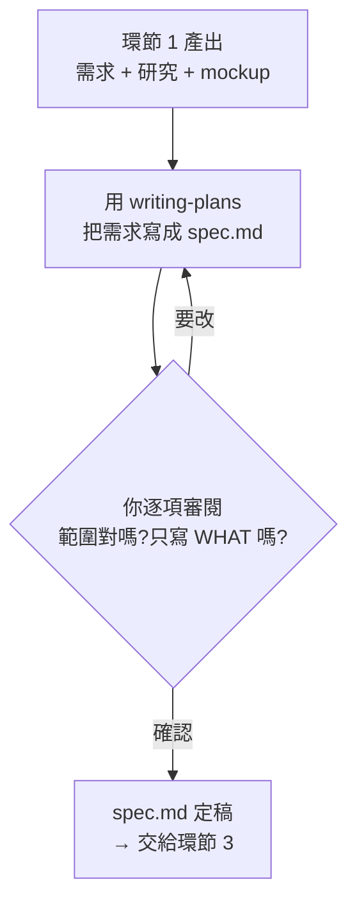

#### 先搞懂：WHAT 與 HOW 分家（這個環節最重要的觀念）

初心者最常見的錯誤，是在規格階段就開始煩惱「要用哪個資料庫」「檔案怎麼拆」。**停**——那是下一個環節的事。把兩件事分清楚：

| | WHAT（spec.md 寫這個） | HOW（留到環節 3 的 plan.md） |
|---|---|---|
| 回答 | 要做什麼、給誰、成功長怎樣 | 用什麼技術、檔案怎麼拆、函式怎麼寫 |
| 例子 | 「使用者能問問題並看到附出處的答案」 | 「用 OpenAI file search + FastAPI」 |

> {{icon:triangle-alert}} **注意**：規格階段一旦陷進技術選型，你會在還沒想清楚「要做什麼」之前就被「怎麼做」綁架。先把 WHAT 定下來。

#### 步驟

承接上一段：你在環節 1 說「ok」後，AI 會用 `writing-plans` **自動產出 `spec.md`**。所以這個環節你主要做一件事——**審閱**。

**逐項審閱 spec.md**

一條一條看過，確認它**涵蓋並符合**下面這些重點：

- 產品要解決的問題與目標使用者。
- 核心功能清單（只有第一版範圍）。
- 每個功能的「可驗證成功條件」（能被測試的句子）。
- 明確寫出「不做什麼」（YAGNI）。

重點檢查三件事：**範圍會不會太大？成功條件能不能被驗證？有沒有偷渡技術細節（HOW）？**

> {{icon:circle-check}} **可驗證成功條件長這樣**（法規問答 AI 範例）
> 「使用者輸入一個勞基法問題，系統在 5 秒內回傳一段答案，並附上**至少一條**法規條文出處。」
> ——注意它**可被測試**：有沒有 5 秒內回？有沒有附出處？而不是模糊的「答得很準」。

> {{icon:wrench}} **萬一 AI 沒有自動產生 spec**：補一句「請用 writing-plans skill 根據我們確認的需求寫出 `spec.md`，只寫 WHAT」即可。

#### 完成檢查（Checkpoint）

- [ ] `spec.md` 存在，且**只寫 WHAT**（沒有技術選型 / 實作細節）。
- [ ] 每個核心功能都有一條**可驗證的成功條件**。
- [ ] **明確列出「不做什麼」**。
- [ ] 你**看得懂每一條、而且同意**。

#### 疑難排解

| 症狀 | 可能原因 | 怎麼辦 |
|---|---|---|
| 規格混進技術選型 / 實作細節 | writing-plans 把 HOW 也寫了 | 要它「把 HOW 移到實作計劃，spec 只留 WHAT」 |
| 成功條件寫得模糊（如「好用」「很準」） | 不可驗證 | 改寫成能被測試的句子（含數字、可觀察的結果） |
| 規格範圍太大、做不完 | 沒做 YAGNI | 砍到「第一版能上線的最小集合」，其餘標為之後再做 |

> {{icon:arrow-right}} **下一步**：環節 3 · 實作計劃——把「要做什麼」翻成「怎麼做」，並用 Context7 驗證技術方案的效度。

---
